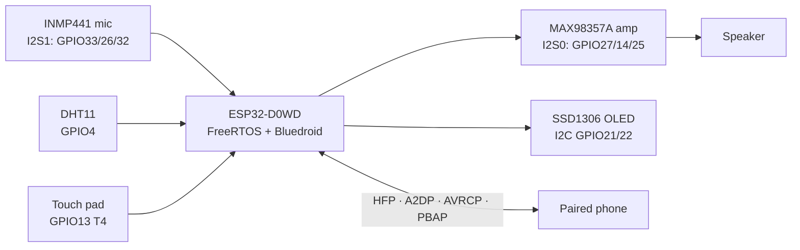
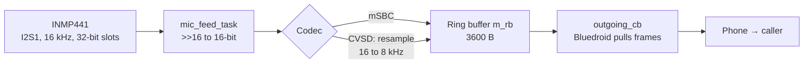
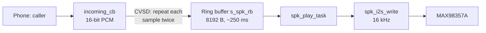
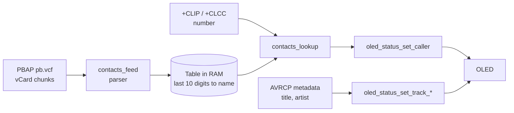
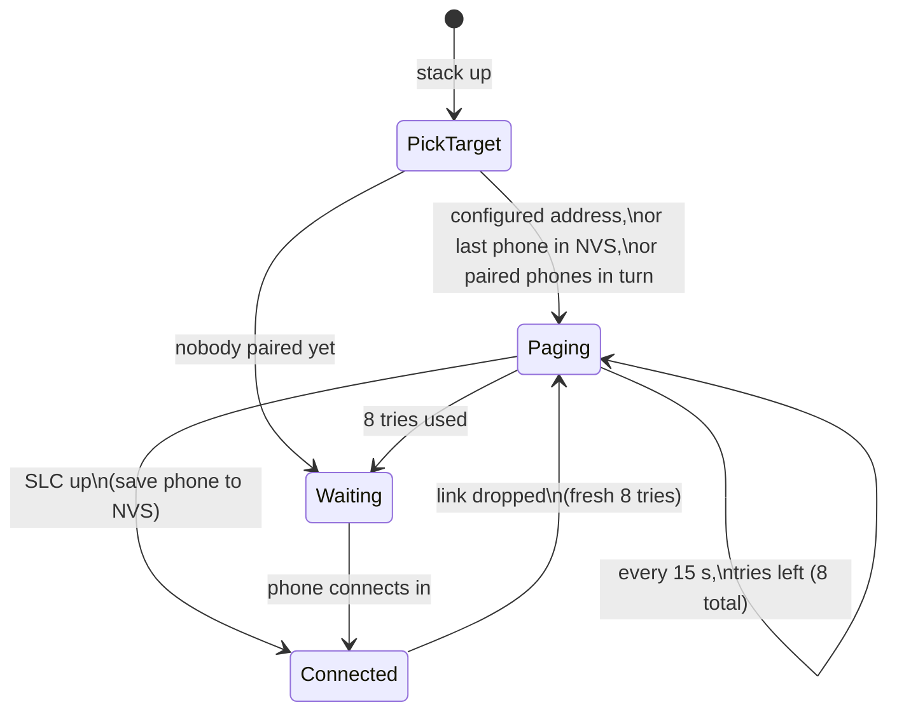
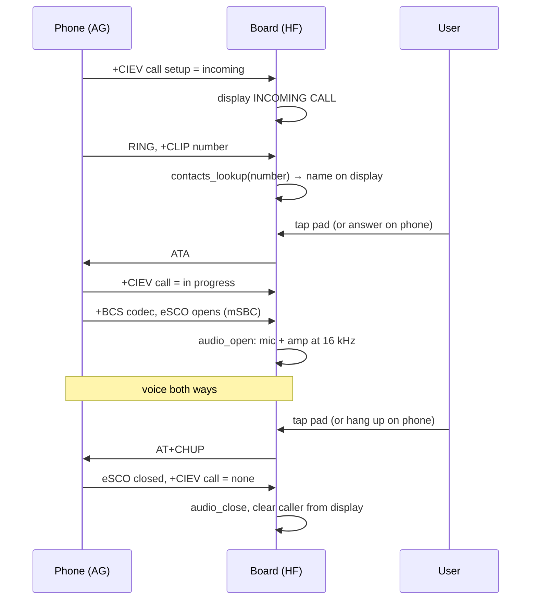

# ESP32 Bluetooth Headset: Complete Product Guide

Sep 25, 2026 · @Ramesh

## 1. Overview

The product is an ESP32 Bluetooth headset with a screen: it carries phone calls, plays music, and shows the caller, the song and the room temperature. It passed the full interactive product test on 2026-09-25 (31 pass, 0 fail), with the touch pad as the one open item.

The firmware is the `hfp_mic_test` project in the GitHub repo [esp32-freertos](https://github.com/arjunevaibhavpatil1434-alt/esp32-freertos), built with ESP-IDF 6.x and FreeRTOS. Nothing is configured after flashing: pair a phone once and the board reconnects to it at every power-on.

### Features and status

| Feature | How it works | Status (2026-09-25) |
| --- | --- | --- |
| Calls: your voice to the caller | INMP441 I2S mic → HFP uplink, 16 kHz mSBC | Verified on real calls |
| Calls: caller's voice | HFP downlink → MAX98357A I2S amp → speaker | Verified on real calls |
| Music | A2DP sink, 44.1 kHz stereo mixed to mono → amp | Verified |
| Song title and artist | AVRCP metadata + track-change notifications | Verified, updates every track |
| Caller name | Phone book pulled over PBAP, matched on the last 10 digits | Verified ("caller found in contacts") |
| Temperature and humidity | DHT11 read every 5 s | Verified, 26 °C / 63–66 % |
| Status display | 128×64 SSD1306 OLED over I2C | Verified |
| Auto-reconnect | Last phone saved in NVS, retried every 15 s × 8 | Verified |
| Touch control | Built-in capacitive touch on GPIO13 | Calibrates; tap not yet detected (open) |

### Block diagram



The mic, sensor and touch pad feed the ESP32; it drives the amp and the display, and talks to the phone over four Bluetooth profiles at once.

### Projects in the repository

| Project | Role |
| --- | --- |
| `hfp_mic_test` | **The product firmware** |
| `pipeline_check` | Whole-board hardware check without a phone (beep, pin readback, sensors) |
| `tools/product_test.py` | Automated and interactive final product test |
| `hw_verify`, `sensor_hub`, `bluetooth_test`, `dht11_temperature`, `freertos_test` | Earlier learning and bring-up projects |
| `speaker_test`, `a2dp_test`, `hfp_mic_test_backup` | Kept for reference only (`speaker_test` drives the old DAC and is silent on this amp) |

## 2. Hardware and wiring

Every part shares the ESP32's GND; everything runs from 3.3 V except the MAX98357A amp, which takes 5 V from the ESP32's VIN pin.

### Bill of materials

| Part | Notes |
| --- | --- |
| ESP32 dev board (ESP32-D0WD-V3, rev v3.1, 4 MB flash) | USB-serial chip CP2102, shows up as `/dev/ttyUSB0` |
| INMP441 I2S MEMS microphone | 24-bit, read as the left slot |
| MAX98357A I2S class-D amplifier + 4–8 Ω speaker | Digital I2S input, 3 W, 9 dB gain with GAIN unconnected |
| SSD1306 128×64 OLED, I2C | Address `0x3C` |
| DHT11 temperature/humidity sensor | Single-wire, uses the ESP32's internal pull-up |
| Touch pad | Wire end, foil or copper tape (\~2×2 cm); uses the ESP32's built-in touch sensor |
| Android phone | Any; tested with a POCO F4 and two other phones |

### Pin map

| Part | Signal | ESP32 pin | Notes |
| --- | --- | --- | --- |
| INMP441 mic | WS (word select) | GPIO33 | I2S1 |
| INMP441 mic | SCK (bit clock) | GPIO26 | I2S1 |
| INMP441 mic | SD (data) | GPIO32 | I2S1 data in |
| INMP441 mic | L/R | GND | Selects the left slot |
| INMP441 mic | VDD / GND | 3V3 / GND |  |
| MAX98357A amp | BCLK | GPIO27 | I2S0 bit clock |
| MAX98357A amp | LRC | GPIO14 | I2S0 word select |
| MAX98357A amp | DIN | GPIO25 | I2S0 data out |
| MAX98357A amp | SD | 3V3 | Must be high, or the amp stays off; selects the left channel |
| MAX98357A amp | GAIN | not connected | 9 dB |
| MAX98357A amp | VIN / GND | VIN (5 V) / GND |  |
| MAX98357A amp | + / − | Speaker | Neither speaker wire goes to GND |
| OLED | SDA / SCL | GPIO21 / GPIO22 | I2C port 0, 400 kHz, internal pull-ups |
| OLED | VCC / GND | 3V3 / GND |  |
| DHT11 | DATA | GPIO4 | Bit-banged, timing-critical |
| DHT11 | VCC / GND | 3V3 / GND |  |
| Touch pad | T4 | GPIO13 | Short wire, away from GPIO27/14 |

### Wiring diagrams

```text
INMP441            ESP32              MAX98357A           ESP32
  WS  ────────── GPIO33               BCLK ───────────── GPIO27
  SCK ────────── GPIO26               LRC  ───────────── GPIO14
  SD  ────────── GPIO32               DIN  ───────────── GPIO25
  L/R ────────── GND                  SD   ───────────── 3V3
  VDD ────────── 3V3                  VIN  ───────────── VIN (5 V)
  GND ────────── GND                  GND  ───────────── GND
                                      +/−  ───────────── speaker

SSD1306 OLED       ESP32              DHT11               ESP32
  SDA ────────── GPIO21               DATA ───────────── GPIO4
  SCL ────────── GPIO22               VCC  ───────────── 3V3
  VCC ────────── 3V3                  GND  ───────────── GND
  GND ────────── GND
                                      Touch pad (foil) ── GPIO13
```

### Why these pins

- **Two I2S ports:** the mic uses I2S1 and the amp I2S0, so each keeps its own clocks and they never interfere.
- **MAX98357A is digital:** it needs BCLK, LRC and DIN. An analog DAC signal on DIN alone gives silence, which is why the first speaker attempt was silent.
- **SD pin:** it has an internal pull-down, so floating SD keeps the amp in shutdown; tie it to 3V3.
- **Touch on GPIO13:** most touch-capable pins are already used; GPIO0 and GPIO12 are boot-strap pins and are avoided.
- **Avoided for the mic:** GPIO5, 18 and 19 (those breadboard rows gave garbage readings in earlier tests).

## 3. Setting up from scratch

A fresh Linux PC needs ESP-IDF, the repo and serial-port access; after that one build command produces the same firmware as the tested board.

1. **Install the build prerequisites** (Ubuntu/Debian):

   ```bash
   sudo apt-get install git wget flex bison gperf python3 python3-venv \
       cmake ninja-build ccache libffi-dev libssl-dev dfu-util libusb-1.0-0
   ```
2. **Install ESP-IDF** (the SDK is not in the repo; it has its own git history). The tested board was built with the checkout at `~/esp/esp-idf` (ESP-IDF 6.x):

   ```bash
   mkdir -p ~/esp && cd ~/esp
   git clone --recursive https://github.com/espressif/esp-idf.git
   ./esp-idf/install.sh esp32
   ```
3. **Clone the product repo:**

   ```bash
   git clone https://github.com/arjunevaibhavpatil1434-alt/esp32-freertos.git
   cd esp32-freertos
   ```
4. **Load the ESP-IDF environment** in every new terminal (puts `idf.py`, the compiler and pyserial on the path):

   ```bash
   . ~/esp/esp-idf/export.sh
   ```
5. **Allow access to the serial port** (once), then log out and in:

   ```bash
   sudo usermod -aG dialout $USER
   ls -l /dev/ttyUSB0          # the board, via its CP2102 USB-serial chip
   ```
6. **Build once to check the setup:**

   ```bash
   cd hfp_mic_test
   idf.py build                # ~1 MB app, 39% of the 1.5 MB partition free
   ```

The target is already `esp32` in the committed `sdkconfig`. If you run `idf.py set-target esp32`, it deletes `sdkconfig` and regenerates it from `sdkconfig.defaults`, which holds the complete configuration, so the result is the same.

Use one ESP-IDF checkout per build folder. Mixing two (for example `~/esp/esp-idf` and a second copy) gives "CMake Error: The source … does not match the source … used to generate cache"; fix it with `idf.py fullclean` or by deleting `build/`.

## 4. Building and flashing

Flash at 115200 baud: on this board's USB link the default 460800 baud has dropped mid-write, while 115200 has been reliable. A dropped flash leaves no app on the board ("No bootable app partitions"); just flash again.

### Everyday commands (run inside the project folder, after `. ~/esp/esp-idf/export.sh`)

| Task | Command |
| --- | --- |
| Build | `idf.py build` |
| Build + flash | `idf.py -p /dev/ttyUSB0 -b 115200 flash` |
| Serial monitor (exit with Ctrl+\]) | `idf.py -p /dev/ttyUSB0 monitor` |
| Flash, then monitor | `idf.py -p /dev/ttyUSB0 -b 115200 flash monitor` |
| App size and free space | `idf.py size` |
| Change settings (menu) | `idf.py menuconfig` |
| Save non-default settings | `idf.py save-defconfig` (overwrites `sdkconfig.defaults`) |
| Clean the build folder | `idf.py fullclean` |
| Erase the whole flash (pairings, last phone, everything) | `idf.py -p /dev/ttyUSB0 erase-flash` |
| Check the board answers | `python -m esptool -p /dev/ttyUSB0 -b 115200 chip-id` |

### Flashing the product

```bash
. ~/esp/esp-idf/export.sh
cd esp32-freertos/hfp_mic_test
idf.py build
idf.py -p /dev/ttyUSB0 -b 115200 flash      # retry if it stops part-way
```

`idf.py flash` writes three images; the equivalent raw esptool command (run from `build/`) is:

```bash
python -m esptool --chip esp32 -b 115200 --before default-reset --after hard-reset \
  write-flash --flash-mode dio --flash-size 4MB --flash-freq 40m \
  0x1000 bootloader/bootloader.bin \
  0x8000 partition_table/partition-table.bin \
  0x10000 hfp_mic_test.bin
```

### Flash layout (4 MB chip, "single app large" partition table)

| Offset | Size | Contents | Survives reflashing? |
| --- | --- | --- | --- |
| 0x1000 | \~26 KB | 2nd-stage bootloader | Rewritten |
| 0x8000 | 3 KB | Partition table | Rewritten |
| 0x9000 | 24 KB | NVS: Bluetooth pairings, last-used phone, PHY calibration | **Yes** (only `erase-flash` clears it) |
| 0xF000 | 4 KB | PHY init data | Yes |
| 0x10000 | 1.5 MB (0x177000) | Factory app: the firmware (\~920 KB, 39% free) | Rewritten |

Because NVS survives, a reflash keeps the phone pairings: the phone reconnects without pairing again.

### Switching between the product and the hardware check

`pipeline_check` has no Bluetooth: while it is flashed, phones can't find `ESP_HFP_HF`. Always flash the product back afterwards.

```bash
cd ../pipeline_check && idf.py -p /dev/ttyUSB0 -b 115200 flash   # hardware check
cd ../hfp_mic_test   && idf.py -p /dev/ttyUSB0 -b 115200 flash   # product back
```

### Capturing the serial log without the monitor

Opening the port with pyserial resets the board (the CP2102's DTR/RTS lines drive EN), so start a capture before asking anyone to act. A minimal capture that resets and records from boot:

```python
import serial, time
s = serial.Serial(); s.port = "/dev/ttyUSB0"; s.baudrate = 115200; s.timeout = 0.2
s.dtr = False; s.rts = True; s.open(); time.sleep(0.1); s.rts = False   # reset, then run
end = time.time() + 30; out = b""
while time.time() < end:
    out += s.read(4096)
open("boot.log", "wb").write(out)
```

### Flash troubleshooting

| Message | Cause | Fix |
| --- | --- | --- |
| "No more data to read from the serial port" / "Failed to start stub flasher" | USB link dropped | Retry at `-b 115200`; better cable, direct PC port |
| "Could not open /dev/ttyUSB0, the port is busy or doesn't exist" | Board unplugged, or a monitor holds the port | Replug; close other monitors |
| "Permission denied" on the port | Not in `dialout` | `sudo usermod -aG dialout $USER`, log in again |
| "invalid segment length 0xffffffff … No bootable app partitions" | Flash stopped part-way | Flash again |
| "Detected size(4096k) larger than the size in the binary image header(2048k)" | Old 2 MB image | Harmless; gone in the current 4 MB build |

## 5. First use and daily operation

Pair once from the phone; from then on the board reconnects to that phone by itself at every power-on.

### First pairing

1. Power the board (USB or VIN). Keep your hand off the touch pad for the first \~2 s: that is when it calibrates.
2. On the phone: **Settings → Bluetooth → Pair new device → `ESP_HFP_HF`**. Confirm the code; if asked for a PIN, it is `0000`.
3. When Android asks, **allow access to contacts and call history**: that is what gives caller names on the display.
4. The display changes to `BT CONNECTED`.

### Every power-on after that

1. The board picks a phone: the last-used one (saved in NVS), else each paired phone in turn.
2. It pages that phone every 15 s, up to 8 times (\~2 min).
3. If none answers, it stops and waits; the phone can still connect from its Bluetooth settings at any time.
4. If a connected phone drops away, a fresh round of 8 tries starts.

### What the display shows

```text
BT CONNECTED           ← or BT WAITING
INCOMING CALL          ← or CALLING / IN CALL (HD) / IN CALL / MUSIC / NO CALL
Ravi Kumar             ← caller name, or song title (scrolls when long)
+919876543210          ← caller number, or artist
────────────────────
Temp      26 °C        ← DHT11, every 5 s; "--" until the first good reading
Humidity  65 %
```

| Line 2 | Meaning |
| --- | --- |
| `INCOMING CALL` | Phone ringing |
| `CALLING` | Outgoing call dialing or ringing out |
| `IN CALL (HD)` | Call audio up over mSBC (16 kHz wideband) |
| `IN CALL` | Call audio over CVSD (8 kHz), or a call without audio |
| `MUSIC` | Music packets arrived in the last second |
| `NO CALL` | Idle; the last song title stays on screen while paused |

Names in scripts other than Latin (for example Kannada or Hindi) show as `?`: the font is ASCII only.

### Touch pad (GPIO13)

| Situation | Tap (touch and lift within 1 s) | Long press (hold 1 s; fires while held) |
| --- | --- | --- |
| Phone ringing | Answer | Reject |
| Dialing or in a call | Hang up | Hang up |
| Otherwise | Music play / pause | Nothing |

The touch pad calibrates but did not register a tap in the 2026-09-25 test; until that is fixed, answer and hang up on the phone.

### Contact sharing, if names don't show

If the log shows `PBA client … Disconnected, reason: 0x5`, the phone refused the phone book. Fix: phone **Settings → Bluetooth → ⓘ next to `ESP_HFP_HF` → turn on Contacts**; if missing, forget the device and pair again, ticking "Allow access to contacts".

## 6. Bluetooth profiles and protocols

The board runs four Classic Bluetooth profiles at once over one link to the phone: HFP for calls, A2DP for music, AVRCP for titles and control, PBAP for the phone book. BLE is disabled to save memory.

### Profiles and roles

| Profile | Phone's role | Board's role | Used for | Source file |
| --- | --- | --- | --- | --- |
| HFP 1.x (Hands-Free) | Audio Gateway (AG) | Hands-Free unit (HF) | Ringing, caller number, answer/hang up, voice both ways | `bt_app_hf.c` |
| A2DP | Source | Sink | Music audio (SBC) to the speaker | `bt_app_av.c` |
| AVRCP | Target | Controller (CT) | Play/pause, title and artist, track-change notifications | `bt_app_av.c` |
| PBAP | Server (PSE) | Client (PCE) | Phone book download for caller names | `bt_app_pbac.c`, `contacts.c` |

### Protocol stack

```text
+---------------------------------------------------------------------+
| App: main.c  bt_app_hf.c  bt_app_av.c  bt_app_pbac.c  spk_i2s.c ... |
+----------------+----------------+--------------+--------------------+
| HFP (HF)       | A2DP sink      | AVRCP CT     | PBAP client        |
+----------------+----------------+--------------+--------------------+
| RFCOMM (AT)    | AVDTP          | AVCTP        | OBEX (over L2CAP)  |
+---------------------------------------------------------------------+
| L2CAP (channels)                SDP (service discovery)             |
+---------------------------------------------------------------------+
| GAP / security: name, discoverable, pairing (SSP / PIN), bonding    |
+---------------------------------------------------------------------+
| HCI (host <-> controller; also carries the call's SCO voice data)   |
+---------------------------------------------------------------------+
| Controller: baseband, link manager, 2.4 GHz radio                   |
+---------------------------------------------------------------------+
```

The controller firmware and the Bluedroid host both run on the ESP32; they talk over an internal HCI. The controller runs on core 0.

### Terms

| Term | Meaning | Where it matters here |
| --- | --- | --- |
| ACL link | Asynchronous data link | Everything except call voice |
| SCO / eSCO | Synchronous voice link with reserved radio slots | Call audio only; one at a time (`MAX_SYNC_CONN=1`) |
| SLC | HFP Service Level Connection (the AT-command session) | Must be up for the board to be a call audio route |
| SSP | Secure Simple Pairing: numeric comparison | The board auto-confirms the code |
| Legacy PIN | Older fixed-PIN pairing | PIN `0000` |
| Bonding | Pairing keys stored in NVS | Survives reflashing; `erase-flash` clears it |
| CVSD | Narrowband voice codec, 8 kHz | Fallback; mic resampled 16 → 8 kHz |
| mSBC | Wideband voice codec, 16 kHz ("HD voice") | What the phones negotiated in tests |
| SBC | A2DP music codec | Decoded by Bluedroid to 16-bit PCM |
| HCI audio data path | Call voice handed to the app as PCM over HCI | Lets the app use I2S mic/amp instead of fixed PCM pins |

### HFP AT commands in use

| Command | Direction | Purpose |
| --- | --- | --- |
| `AT+BRSF`, `AT+BAC` | Board → phone | Features; offer codecs (CVSD, mSBC) |
| `AT+CIND`, `AT+CMER` | Board → phone | Read and subscribe to call, setup, signal, battery indicators |
| `RING`, `+CLIP: <number>` | Phone → board | Incoming call and caller number |
| `AT+CLCC` | Board → phone | List current calls: gives the number on outgoing calls |
| `ATA` | Board → phone | Answer (touch tap) |
| `AT+CHUP` | Board → phone | Reject or hang up (touch) |
| `+BCS` / `AT+BCS` | Both | Codec selection before the voice link opens |
| `+VGS` | Phone → board | Speaker volume (logged) |

### Other profile traffic

| Profile | Request | Result |
| --- | --- | --- |
| AVRCP | Get notification capabilities | Phone lists events it can report (e.g. `0x1f26`) |
| AVRCP | Register `TRACK_CHANGE` (re-registered after each one) | Board is told every time the song changes |
| AVRCP | Get metadata: title, artist | Shown on the display |
| AVRCP | Pass-through PLAY / PAUSE | Sent by a touch tap |
| PBAP | Set path `telecom`, pull `telecom/pb.vcf` with `max_list_count=0` | Phone book size |
| PBAP | Pull `telecom/pb.vcf`, properties VERSION, FN, N, TEL only | vCards parsed into the contacts table |

### Codecs and rates

| Stream | Rate on air | Rate at the app | Encoded/decoded by |
| --- | --- | --- | --- |
| Call, mSBC | 16 kHz | 16 kHz, 16-bit mono | Bluedroid |
| Call, CVSD | 8 kHz | 8 kHz, 16-bit mono | Bluedroid |
| Music, SBC | 44.1 or 48 kHz stereo | 16-bit stereo, mixed to mono by the app | Bluedroid |

## 7. Pipelines (how data flows)

Six data paths run side by side: mic to caller, caller to speaker, music to speaker, phone book to display, sensor to display, and touch to phone. The two audio outputs share one amp driver, and calls always win over music.

### Tasks and cores

| Task | Priority | Core | Stack | Created in | Job |
| --- | --- | --- | --- | --- | --- |
| Bluetooth controller + Bluedroid (BTC) | stack's own | 0 | — | ESP-IDF | Radio, profiles, all Bluetooth callbacks |
| `BtAppT` | max − 3 | any | 4 KB | `bt_app_core.c` | Runs dispatched Bluetooth events in order |
| `mic_feed_task` | 6 | any | 4 KB | `bt_app_hf.c` | Mic → call, during calls |
| `spk_play_task` | 6 | any | 3 KB | `bt_app_hf.c` | Call audio → amp, during calls |
| `touch` | 4 | 1 | 3 KB | `touch_ctl.c` | Polls the pad every 20 ms |
| `dht11` | 3 | 1 | 3 KB | `main.c` | Reads the sensor every 5 s |
| `oled` | 2 | any | 3 KB | `oled_status.c` | Redraws the screen every 150 ms |

The DHT11 and touch tasks are pinned to core 1 because a DHT11 read masks interrupts for \~4 ms, which must not hit the Bluetooth controller on core 0.

### 1. Uplink: mic → caller



1. `mic_feed_task` reads 256 samples at a time from I2S1 (the INMP441 puts 24-bit audio in the top of 32-bit slots).
2. It keeps the top 16 bits of each sample (`>> 16`).
3. On a CVSD call it resamples 16 → 8 kHz with `esp_hf_client_pcm_resample()`.
4. It pushes the PCM into ring buffer `m_rb` (3600 bytes) and calls `esp_hf_client_outgoing_data_ready()`.
5. Bluedroid calls `bt_app_hf_client_outgoing_cb()` to pull exact-size frames, encodes them (mSBC or CVSD) and sends them on the eSCO link.

### 2. Downlink: caller → speaker



1. Bluedroid decodes the call audio and calls `bt_app_hf_client_incoming_cb()` with 16-bit PCM.
2. On CVSD (8 kHz) each sample is written twice, so the amp always runs at 16 kHz.
3. The callback puts the PCM in `s_spk_rb` without ever blocking; if the buffer is full it drops audio and logs a rate-limited warning.
4. `spk_play_task` takes up to 256 samples at a time and writes them to the amp; when the buffer is empty it writes silence, so gaps don't click.

### 3. Music: phone → speaker

```mermaid
flowchart LR
    P[Phone music app] --> A[A2DP: SBC\n44.1 kHz stereo]
    A --> C[bt_app_a2d_data_cb\nPCM L+R]
    C -->|call active?| X[drop]
    C -->|mix (L+R)/2| S[spk_i2s_write\n44.1 kHz]
    S --> AMP[MAX98357A]
```

1. Bluedroid decodes SBC and calls `bt_app_a2d_data_cb()` with 16-bit stereo PCM.
2. If call audio is active, the music data is dropped: calls own the speaker.
3. The amp is switched to the stream's rate (read from the codec config: usually 44.1 kHz).
4. Each stereo pair is averaged to mono, because SD on 3V3 makes the amp play only the left channel.
5. The mono samples go to the amp in blocks of 256; each write waits at most 100 ms.

### 4. Shared amp driver: calls vs music

| Event | Amp rate | Who writes |
| --- | --- | --- |
| Music playing | 44.1 / 48 kHz | `bt_app_a2d_data_cb` |
| Call audio opens | switched to 16 kHz | `spk_play_task` (music dropped) |
| Call audio closes | switched back on the next music packet | `bt_app_a2d_data_cb` |

`spk_i2s_set_rate()` and `spk_i2s_write()` share a mutex, so a rate change never happens in the middle of a write.

### 5. Caller name and song title → display



The phone book is parsed as it streams in and is never logged. A caller's number is matched on its last 10 digits, so `+91 98765 43210` and `098765 43210` both match.

### 6. Sensor and touch

- **DHT11:** `dht_task` reads every 5 s; a good reading updates the temperature and humidity shown on screen; a failed read (checksum or timeout) is skipped and the last good value stays.
- **Touch:** `touch_task` reads the pad's filtered value every 20 ms; a drop below 85% of the untouched baseline for 2 reads is a press; the gesture triggers answer / reject / hang up (HFP AT commands) or play / pause (AVRCP).

## 8. Workflows (what happens, in order)

From power-on the board is ready in about 1.3 s: Bluetooth up, display on, and paging the last phone.

### Boot sequence (`app_main` in `main.c`)

1. **NVS:** `nvs_flash_init()`; if the NVS area is full or from a newer version, erase and init again. NVS holds pairings and the last phone.
2. **Bluetooth controller:** release BLE memory (`esp_bt_controller_mem_release(ESP_BT_MODE_BLE)`), `esp_bt_controller_init()`, `esp_bt_controller_enable(ESP_BT_MODE_CLASSIC_BT)`.
3. **Bluedroid host:** `esp_bluedroid_init_with_cfg()` (Secure Simple Pairing on), `esp_bluedroid_enable()`.
4. **Peripherals:** `oled_status_start()` (display task), the DHT11 task on core 1, `touch_ctl_start()` (touch task on core 1).
5. **App task:** `bt_app_task_start_up()` creates `BtAppT` and its queue.
6. **Stack-up event**, dispatched to `BtAppT`:
   1. Set the device name (`ESP_HFP_HF`).
   2. Register callbacks and init: GAP, HFP client, PBAP client, A2DP sink + AVRCP controller.
   3. Security: SSP IO capability, fixed PIN `0000` for legacy pairing.
   4. Connectable + discoverable.
   5. Start the reconnect logic (below).
7. The UART console is compiled out in the product build (`CONFIG_EXAMPLE_ENABLE_CONSOLE_REPL=n`).

### Reconnect logic (`main.c`)



| Step | Function | Detail |
| --- | --- | --- |
| Choose target | `pick_target()` | `CONFIG_EXAMPLE_PEER_DEVICE_ADDR` if set → else last phone from NVS key `bt_app/last_peer` if still paired → else the paired list, rotating one per try |
| Try | `try_reconnect()` | `esp_hf_client_connect()`, then arms a 15 s one-shot timer for the next try |
| Success | `bt_app_peer_connected()` | Called on `slc_connected`; saves the phone to NVS, stops the timer |
| Loss | `bt_app_peer_disconnected()` | Called on `disconnected`; only a live link that dropped starts a new round |

The timer drives retries because a phone that is off or out of range doesn't always produce a disconnect event. There is no discovery loop while a target exists: a looping inquiry kept the radio busy and made connections fail in both directions.

### Incoming call



### Outgoing call

1. The phone reports call setup `OUTGOING_DIALING`; the display shows `CALLING`.
2. The board sends `AT+CLCC`; the reply carries the number, which is looked up and shown.
3. Setup goes to `OUTGOING_ALERTING` (ringing out), then call `in progress` when answered; the voice link opens as for an incoming call.

### Music

1. The phone opens A2DP + AVRCP after the HFP link.
2. AVRCP: the board asks which notifications the phone supports, registers `TRACK_CHANGE`, and asks for title and artist.
3. When a song starts: A2DP `Started`; the board asks for metadata again (in case a notification was skipped) and the display shows `MUSIC` while packets arrive.
4. On each track change: new title and artist, and the notification is registered again (they are one-shot).
5. If a call starts, the phone suspends A2DP; the amp switches to 16 kHz for the call and back when music resumes.

## 9. Source tree and file locations

The product firmware is 23 source files (\~3,500 lines) in `hfp_mic_test/main/`; the test tool and the hardware check sit beside it. Paths are relative to the repo root (`esp32-freertos/`).

### Repository layout

```text
esp32-freertos/
├── README.md                     project index + setup
├── .gitignore                    ignores esp-idf/, build/, test_reports/*.log, ...
├── docs/PROJECT_GUIDE.md         in-repo engineering guide
│
├── hfp_mic_test/                 ★ THE PRODUCT FIRMWARE
│   ├── CMakeLists.txt            ESP-IDF project file
│   ├── sdkconfig.defaults        complete build configuration (source of truth)
│   ├── sdkconfig                 generated full configuration (committed)
│   └── main/
│       ├── CMakeLists.txt        source list + driver components
│       ├── Kconfig.projbuild     menuconfig options (device name, pinned phone, console)
│       ├── main.c                boot, reconnect logic, DHT11 task, GAP callback
│       ├── bt_app_core.c/.h      BtAppT task + event queue
│       ├── bt_app_hf.c/.h        HFP: call events, mic uplink, call downlink
│       ├── bt_app_av.c/.h        A2DP music to amp, AVRCP titles + control
│       ├── bt_app_pbac.c/.h      PBAP phone book download
│       ├── contacts.c/.h         vCard parser + number → name table
│       ├── spk_i2s.c/.h          MAX98357A I2S driver (shared)
│       ├── oled_status.c/.h      status screen
│       ├── touch_ctl.c/.h        touch pad gestures
│       ├── dht11.c/.h            DHT11 driver
│       ├── app_hf_msg_set.c/.h   console commands for HFP (console off in product)
│       └── app_av_msg_set.c/.h   console commands for A2DP/AVRCP
│
├── pipeline_check/               whole-board hardware check (no Bluetooth)
│   ├── CMakeLists.txt, sdkconfig
│   └── main/ main.c, dht11.c/.h, CMakeLists.txt
│
├── tools/product_test.py         automated + interactive product test
├── test_reports/                 test reports (.md tracked; raw .log kept local)
│
├── hw_verify/  sensor_hub/  bluetooth_test/  dht11_temperature/  freertos_test/
│                                 earlier bring-up projects
└── speaker_test/  a2dp_test/  hfp_mic_test_backup/
                                  reference copies (speaker_test drives the old DAC)
```

### Product files at a glance

| File | Lines | Role |
| --- | --- | --- |
| `hfp_mic_test/main/main.c` | 519 | Boot, Bluetooth init, reconnect, DHT11 task, GAP events |
| `hfp_mic_test/main/bt_app_hf.c` | 798 | HFP events, mic and call-audio pipelines |
| `hfp_mic_test/main/app_hf_msg_set.c` | 508 | Console commands for HFP (compiled out in the product) |
| `hfp_mic_test/main/bt_app_av.c` | 259 | A2DP music, AVRCP metadata and control |
| `hfp_mic_test/main/oled_status.c` | 256 | Display task, font, layout |
| `hfp_mic_test/main/contacts.c` | 187 | vCard parser, lookup table |
| `hfp_mic_test/main/touch_ctl.c` | 135 | Touch pad driver and gestures |
| `hfp_mic_test/main/bt_app_core.c` | 134 | App task and dispatch queue |
| `hfp_mic_test/main/dht11.c` | 132 | DHT11 bit-bang driver |
| `hfp_mic_test/main/app_av_msg_set.c` | 124 | Console commands for A2DP/AVRCP |
| `hfp_mic_test/main/bt_app_pbac.c` | 90 | PBAP client events |
| `hfp_mic_test/main/spk_i2s.c` | 78 | Amp driver |
| `hfp_mic_test/main/*.h` | 11–52 each | Interfaces between the files |
| `tools/product_test.py` | 473 | Product test |
| `pipeline_check/main/main.c` | 477 | Hardware check |

### Generated and local-only locations

| Path | What | In git? |
| --- | --- | --- |
| `hfp_mic_test/build/` | Build output: `hfp_mic_test.bin`, `bootloader/bootloader.bin`, `partition_table/partition-table.bin`, `flash_args` | No |
| `hfp_mic_test/build/log/` | Full `idf.py` output of the last commands | No |
| `test_reports/*.log` | Raw serial logs of each test stage (contain phone addresses) | No |
| `~/esp/esp-idf/` | The ESP-IDF SDK | No (separate checkout) |
| `~/.espressif/` | Toolchain and the Python environment with pyserial | No |

## 10. File-by-file code walkthrough

Each product file does one job and exposes a small interface in its `.h`; the snippets below are the real code, trimmed only where marked `...`. All files are in `hfp_mic_test/main/`.

### main.c: boot, reconnect, DHT11, pairing

**What it does:** brings up NVS and Bluetooth, starts the display, sensor and touch tasks, handles pairing (GAP), and owns the reconnect-to-last-phone logic.

| Function | Job |
| --- | --- |
| `app_main()` | Boot sequence (section 8) |
| `bt_hf_client_hdl_stack_evt()` | Stack-up: name, profile init, PIN, discoverable, `pick_target()` + `try_reconnect()` |
| `esp_bt_gap_cb()` | GAP events: pairing done, PIN request (replies `0000`), SSP numeric comparison (auto-confirms), discovery results |
| `pick_target()` | Configured address → last phone from NVS (if still paired) → paired phones in turn |
| `try_reconnect()`, `reconnect_timer_cb()` | One connect attempt, and arm the 15 s timer for the next |
| `bt_app_peer_connected()` / `bt_app_peer_disconnected()` | Called from `bt_app_hf.c` on link up / down |
| `save_last_peer()`, `load_last_peer()` | NVS blob `bt_app` / `last_peer` (6 bytes) |
| `is_bonded()`, `nth_bonded()` | Read the bonded-device list |
| `dht_task()` | DHT11 every 5 s → `g_stat_temp_c`, `g_stat_humidity` |
| `parse_peer_addr()`, `bda2str()` | Address text ↔ bytes |

Key code, the retry loop:

```c
/* Each try arms the timer for the next: a phone that is off or out of range
 * doesn't always produce a disconnect event to retry from. */
static void try_reconnect(void)
{
    if (s_link_up || !s_have_target) {
        return;
    }
    if (s_tries_left <= 0) {
        ESP_LOGI(BT_HF_TAG, "Phone not reachable; waiting for it to connect");
        return;
    }
    s_tries_left--;
    if (s_rotate_bonded) {
        nth_bonded(s_bond_idx++, peer_addr);
    }
    ...
    esp_hf_client_connect(peer_addr);
    esp_timer_stop(s_reconnect_timer);
    esp_timer_start_once(s_reconnect_timer, RECONNECT_INTERVAL_MS * 1000ULL);
}
```

The DHT11 task, pinned to core 1:

```c
/* Feeds the display. Pinned to core 1: a read masks interrupts for ~4 ms,
 * which must not land on core 0 where the Bluetooth controller runs. */
static void dht_task(void *arg)
{
    dht11_init(DHT11_GPIO);
    int fails = 0;
    while (1) {
        dht11_data_t d;
        if (dht11_read(DHT11_GPIO, &d) == ESP_OK) {
            if (g_stat_temp_c < 0) {
                ESP_LOGI(BT_HF_TAG, "DHT11: first reading %d C, %d %%", d.temperature, d.humidity);
            }
            g_stat_temp_c = d.temperature;
            g_stat_humidity = d.humidity;
            fails = 0;
        } else if (++fails == 3) {
            ESP_LOGW(BT_HF_TAG, "DHT11: 3 reads in a row failed - check GPIO%d wiring", DHT11_GPIO);
        }
        vTaskDelay(pdMS_TO_TICKS(DHT11_PERIOD_MS));
    }
}
```

### bt\_app\_core.c / .h: the app task

**What it does:** gives Bluetooth callbacks a safe place to run. A callback copies its parameters into a message and posts it to a queue (10 deep); task `BtAppT` (4 KB, priority max − 3) runs the handler later, in order.

```c
bool bt_app_work_dispatch(bt_app_cb_t p_cback, uint16_t event, void *p_params, int param_len,
                          bt_app_copy_cb_t p_copy_cback, bt_app_free_cb_t p_free_cback);
```

`p_copy_cback` / `p_free_cback` handle parameters with pointers inside (the AVRCP title text is deep-copied this way). The stack-up event and all A2DP/AVRCP events go through this queue; HFP and PBAP callbacks run directly on Bluedroid's BTC task.

### bt\_app\_hf.c / .h: calls

**What it does:** handles every HFP event, runs the mic uplink and the call-audio downlink, and updates the display state.

| Part | Code |
| --- | --- |
| Event handler | `bt_app_hf_client_cb()`: connection, audio state, call / call-setup indicators, `CLIP`, `CLCC`, volume, signal, battery, ... (20+ events, each logged) |
| Mic setup (once) | `mic_lazy_init()`: I2S1 master, 16 kHz, 32-bit Philips, mono left slot, pins WS 33 / SCK 26 / SD 32; CVSD resampler init |
| Mic task | `mic_feed_task()`: read → `>> 16` → optional resample → ring buffer `m_rb` → `esp_hf_client_outgoing_data_ready()` |
| Bluedroid pulls mic | `bt_app_hf_client_outgoing_cb()`: hands exactly `sz` bytes from `m_rb` |
| Caller audio in | `bt_app_hf_client_incoming_cb()`: 16-bit PCM → `s_spk_rb` (8 KB); CVSD samples repeated ×2 |
| Speaker task | `spk_play_task()`: `s_spk_rb` → `spk_i2s_write()`, silence on underrun |
| Audio open / close | `bt_app_hf_client_audio_open(wideband)`, `bt_app_hf_client_audio_close()`: set / clear `s_audio_active`, amp to 16 kHz, drain buffers |
| Caller display | `show_caller()` (lookup + `oled_status_set_caller()`), `clear_caller_if_idle()` |
| Exposed | `bt_app_hf_audio_active()`: lets the music code stay quiet during calls |

The caller lookup:

```c
/* Shows the caller: contact name when the phonebook has the number. */
static void show_caller(const char *number)
{
    char name[40];
    if (!number || !number[0]) {
        return;
    }
    bool found = contacts_lookup(number, name, sizeof(name));
    ESP_LOGI(BT_HF_TAG, "caller %s", found ? "found in contacts" : "not in contacts");
    oled_status_set_caller(found ? name : NULL, number);
}
```

How the call state drives the display and the reconnect logic:

```c
case ESP_HF_CLIENT_CONNECTION_STATE_EVT:
    ...
    g_stat_slc = param->conn_stat.state == ESP_HF_CLIENT_CONNECTION_STATE_SLC_CONNECTED;
    if (param->conn_stat.state == ESP_HF_CLIENT_CONNECTION_STATE_SLC_CONNECTED) {
        bt_app_peer_connected(param->conn_stat.remote_bda);
        esp_pbac_connect(peer_addr);
    } else if (param->conn_stat.state == ESP_HF_CLIENT_CONNECTION_STATE_CONNECTED) {
        hf_client_connected = true;
    } else if (param->conn_stat.state == ESP_HF_CLIENT_CONNECTION_STATE_DISCONNECTED) {
        hf_client_connected = false;
        g_stat_in_call = g_stat_ringing = g_stat_outgoing = false;
        oled_status_set_caller(NULL, NULL);
        bt_app_peer_disconnected();
    }
...
case ESP_HF_CLIENT_CIND_CALL_SETUP_EVT:
    ...
    g_stat_ringing = param->call_setup.status == ESP_HF_CALL_SETUP_STATUS_INCOMING;
    g_stat_outgoing = param->call_setup.status == ESP_HF_CALL_SETUP_STATUS_OUTGOING_DIALING ||
                      param->call_setup.status == ESP_HF_CALL_SETUP_STATUS_OUTGOING_ALERTING;
    if (param->call_setup.status == ESP_HF_CALL_SETUP_STATUS_OUTGOING_DIALING) {
        /* no CLIP for outgoing calls; ask the phone for the number */
        esp_hf_client_query_current_calls();
    }
    clear_caller_if_idle();
    break;
```

### bt\_app\_av.c / .h: music and track titles

**What it does:** A2DP sink (music into the amp) and AVRCP controller (titles, track changes, play/pause). Events are dispatched to `BtAppT`; audio data arrives in `bt_app_a2d_data_cb()` on the BTC task.

| Part | Code |
| --- | --- |
| Stream format | `ESP_A2D_AUDIO_CFG_EVT`: reads the SBC sample rate (16/32/44.1/48 kHz) and channel mode into `s_a2d_rate`, `s_a2d_channels` |
| Stream start | `ESP_A2D_AUDIO_STATE_EVT` Started → `bt_app_av_request_metadata()` |
| AVRCP connect | Ask notification capabilities, request title + artist |
| Capabilities reply | Store the bit mask; register `TRACK_CHANGE` if supported |
| Track changed | Request title + artist again, re-register (notifications are one-shot) |
| Metadata reply | `oled_status_set_track_title()` / `_artist()`; the phone's placeholder `unknow` is hidden by `track_text()` |
| Control | `bt_app_av_passthrough(key)`: press + release, used by touch for PLAY / PAUSE |

The music path (runs for every decoded SBC packet):

```c
static void bt_app_a2d_data_cb(const uint8_t *data, uint32_t len)
{
    g_stat_music_tick = xTaskGetTickCount();
    ...
    if (bt_app_hf_audio_active() || !spk_i2s_set_rate(s_a2d_rate)) {
        return;                                    /* calls own the speaker */
    }

    const int16_t *pcm = (const int16_t *)data;
    int ch = s_a2d_channels;
    uint32_t frames = len / (sizeof(int16_t) * ch);
    int16_t mono[256];
    uint32_t n = 0;
    for (uint32_t i = 0; i < frames; i++) {
        int16_t v = ch == 2 ? (int16_t)(((int32_t)pcm[2 * i] + pcm[2 * i + 1]) / 2) : pcm[i];
        mono[n++] = v;
        if (n == sizeof(mono) / sizeof(mono[0]) || i == frames - 1) {
            spk_i2s_write(mono, n, pdMS_TO_TICKS(100));
            n = 0;
        }
    }
}
```

### bt\_app\_pbac.c / .h: phone book download

**What it does:** after the call link is up, opens PBAP, asks for the phone book size (`max_list_count = 0`), then pulls `telecom/pb.vcf` with only VERSION, FN, N and TEL (`property_selector = bits 0, 1, 2, 7`). Each response chunk goes to `contacts_feed()`; contacts are never printed. The final response logs `N contact numbers loaded`.

### contacts.c / .h: caller names

**What it does:** a streaming vCard parser and a number → name table in RAM.

| Function | Job |
| --- | --- |
| `contacts_reset()` | Empty the table before a new download |
| `contacts_feed(data, len)` | Split chunks into lines (chunks may break lines anywhere), parse `BEGIN`/`FN`/`N`/`TEL`/`END` |
| `copy_value()` | Decodes `ENCODING=QUOTED-PRINTABLE` names |
| `add_contact()` | Grows the table by 100 entries while at least 40 KB heap stays free, up to 1500 |
| `contacts_lookup(number, name, size)` | Matches on the last up-to-10 digits (minimum 7) |
| `contacts_count()`, `contacts_full()` | For the log line |

Each entry is a 24-byte name + 11-byte number (35 bytes). If a vCard has no `FN`, the name is built from `N` as "Given Family".

```c
bool contacts_lookup(const char *number, char *name, size_t name_size)
{
    char want[NUM_DIGITS + 1];
    last_digits(number ? number : "", want);
    size_t wl = strlen(want);
    if (wl < MIN_MATCH) {
        return false;
    }
    int n = s_count;
    for (int i = 0; i < n; i++) {
        size_t cl = strlen(s_tab[i].num);
        size_t m = cl < wl ? cl : wl;
        if (m >= MIN_MATCH && !strcmp(s_tab[i].num + cl - m, want + wl - m)) {
            strlcpy(name, s_tab[i].name, name_size);
            return true;
        }
    }
    return false;
}
```

### spk\_i2s.c / .h: the amp driver

**What it does:** the only code that touches the MAX98357A. I2S0 master, 16-bit, mono data sent on both slots (so any SD channel setting plays it), `auto_clear` so an underrun plays zeros.

| Function | Job |
| --- | --- |
| `spk_i2s_set_rate(rate)` | Creates the channel on first use; reconfigures the clock when the rate changes (disable → reconfig → enable) |
| `spk_i2s_write(pcm, samples, timeout)` | Queues samples to DMA |

```c
bool spk_i2s_set_rate(uint32_t rate)
{
    ...
    xSemaphoreTake(s_lock, portMAX_DELAY);
    bool ok = true;
    if (!s_tx) {
        ok = spk_create(rate);
    } else if (rate != s_rate) {
        i2s_std_clk_config_t clk = I2S_STD_CLK_DEFAULT_CONFIG(rate);
        ok = i2s_channel_disable(s_tx) == ESP_OK &&
             i2s_channel_reconfig_std_clock(s_tx, &clk) == ESP_OK &&
             i2s_channel_enable(s_tx) == ESP_OK;
    }
    ...
    xSemaphoreGive(s_lock);
    return ok;
}
```

### oled\_status.c / .h: the display

**What it does:** a task that redraws the 128×64 screen every 150 ms from shared status variables.

| Part | Detail |
| --- | --- |
| Status inputs | `g_stat_slc`, `g_stat_in_call`, `g_stat_ringing`, `g_stat_outgoing`, `g_stat_audio`, `g_stat_wideband`, `g_stat_music_tick`, `g_stat_temp_c`, `g_stat_humidity` (set by the other files) |
| Text inputs | `oled_status_set_caller()`, `oled_status_set_track_title()`, `_artist()`: copied under a spinlock; each non-ASCII character becomes `?` |
| Panel bring-up | I2C port 0 at 400 kHz, probe `0x3C`, `esp_lcd` SSD1306 driver; retries every 1 s until the panel answers |
| Font | Classic 5×7 ASCII (95 glyphs) + a degree sign in slot 0x7F |
| Drawing | Page-format framebuffer (1 KB), `fb_text()`, `fb_text_scroll()` (3 px per redraw, 24 px gap), `fb_hline()` |
| Music detection | `MUSIC` when an A2DP packet arrived in the last 1000 ms |

### touch\_ctl.c / .h: the touch pad

**What it does:** reads touch channel T4 (GPIO13) with ESP-IDF's touch driver (continuous scanning, software filter every 10 ms), calibrates a baseline from 20 readings, and turns presses into gestures.

| Constant | Value | Meaning |
| --- | --- | --- |
| `POLL_MS` | 20 | Read interval |
| `PRESS_RATIO` | 0.85 | Touched below 85% of baseline |
| `RELEASE_RATIO` | 0.92 | Released above 92% |
| `DEBOUNCE_POLLS` | 2 | Readings needed to accept a change |
| `LONG_PRESS_MS` | 1000 | Long-press time |

```c
if (!pressed) {
    streak = below ? streak + 1 : 0;
    if (streak >= DEBOUNCE_POLLS) {
        pressed = true;
        long_fired = false;
        streak = 0;
        press_start = xTaskGetTickCount();
    } else if (!below) {
        /* follow slow drift (temperature, humidity) while untouched */
        baseline += (v - baseline) * 0.01f;
    }
} else {
    if (!long_fired && xTaskGetTickCount() - press_start >= pdMS_TO_TICKS(LONG_PRESS_MS)) {
        long_fired = true;          /* fire while still held */
        on_gesture(true);
    }
    streak = above ? streak + 1 : 0;
    if (streak >= DEBOUNCE_POLLS) {
        pressed = false;
        streak = 0;
        if (!long_fired) {
            on_gesture(false);
        }
    }
}
```

`on_gesture(long_press)` picks the action from the call state: ringing → `esp_hf_client_answer_call()` or `esp_hf_client_reject_call()`; in a call → `esp_hf_client_reject_call()` (sends `AT+CHUP`, which also hangs up); otherwise → AVRCP PLAY or PAUSE.

### dht11.c / .h: the sensor driver

**What it does:** bit-bangs the DHT11 protocol on GPIO4: pull low 20 ms, then read the sensor's response and 40 data bits. Each bit's length is judged by sampling the line 40 µs after it goes high. The \~4 ms frame runs inside a critical section so interrupts can't stretch the timing; the checksum (byte 4 = sum of bytes 0–3) rejects corrupted frames.

### app\_hf\_msg\_set.c, app\_av\_msg\_set.c: console commands

The UART console commands (`hfp_hf>` prompt): `con`/`dis`, `cona`/`disa`, `ac`/`rc` answer/reject, `d <num>` dial, `qc` current calls, `vu` volume, `k <dtmf>`, `acon`/`adis`, `play`/`pause`/`next`/`prev`, `md` metadata. They are compiled out in the product build; enable "Enable UART interactive console" in menuconfig to use them.

### Build files

| File | Content |
| --- | --- |
| `hfp_mic_test/CMakeLists.txt` | Standard ESP-IDF project file: `project(hfp_mic_test)` |
| `hfp_mic_test/main/CMakeLists.txt` | The 12 `.c` files + driver components: `bt nvs_flash console esp_ringbuf esp_driver_i2s esp_driver_i2c esp_driver_gpio esp_driver_touch_sens esp_lcd` |
| `hfp_mic_test/main/Kconfig.projbuild` | Menu "HFP Example Configuration" (section 11) |
| `hfp_mic_test/sdkconfig.defaults` | Complete configuration (section 11) |
| `hfp_mic_test/sdkconfig` | Generated from the defaults; committed |

## 11. Configuration

`hfp_mic_test/sdkconfig.defaults` holds every setting the product needs beyond ESP-IDF's defaults: deleting `sdkconfig` and building regenerates the exact tested configuration. Edit this file (or use `idf.py menuconfig` then `idf.py save-defconfig`), never only `sdkconfig`.

### sdkconfig.defaults, line by line

| Setting | Value | Why |
| --- | --- | --- |
| `CONFIG_ESPTOOLPY_FLASHSIZE_4MB` | y | The module has 4 MB; the image header must say so |
| `CONFIG_PARTITION_TABLE_SINGLE_APP_LARGE` | y | 1.5 MB app partition; the \~920 KB app didn't fit comfortably in 1 MB |
| `CONFIG_BT_ENABLED` | y | Bluetooth on |
| `CONFIG_BT_BLE_ENABLED` | n | Classic only; saves RAM |
| `CONFIG_BTDM_CTRL_MODE_BR_EDR_ONLY` | y | Controller in Classic-only mode |
| `CONFIG_BTDM_CTRL_BR_EDR_MAX_SYNC_CONN` | 1 | One voice (SCO/eSCO) link |
| `CONFIG_BT_BLUEDROID_ENABLED` | y | Bluedroid host stack |
| `CONFIG_BT_CLASSIC_ENABLED` | y | Classic profiles |
| `CONFIG_BT_HFP_ENABLE`, `CONFIG_BT_HFP_CLIENT_ENABLE` | y | Hands-Free unit role |
| `CONFIG_BT_HFP_AUDIO_DATA_PATH_HCI` | y | Call voice as PCM to the app (I2S mic/amp), not fixed PCM pins |
| `CONFIG_BT_PBAC_ENABLED` | y | Phone book client |
| `CONFIG_BT_A2DP_ENABLE` | y | Music sink + AVRCP |
| `CONFIG_EXAMPLE_LOCAL_DEVICE_NAME` | `"ESP_HFP_HF"` | Name phones see |
| `CONFIG_EXAMPLE_PEER_DEVICE_ADDR` | `""` | No phone hard-coded |
| `CONFIG_EXAMPLE_PEER_DEVICE_NAME` | `""` | No discovery by name |
| `CONFIG_EXAMPLE_ENABLE_CONSOLE_REPL` | n | No UART console in the product |

Wideband speech (`CONFIG_BT_HFP_WBS_ENABLE`, mSBC) is on by ESP-IDF's default, so it isn't listed.

### Why the console is off

The UART console's start-up swallowed log lines that other tasks printed at the same moment: the display's "status display on" line was missing in 6 of 8 boots with the console and in 0 of 8 without. The display itself was fine. A product's serial port is never typed into, so the console is off; turn it on in menuconfig for development.

### menuconfig options (`main/Kconfig.projbuild`, menu "HFP Example Configuration")

| Option | Default | Meaning |
| --- | --- | --- |
| `EXAMPLE_LOCAL_DEVICE_NAME` | `ESP_HFP_HF` | This device's Bluetooth name |
| `EXAMPLE_PEER_DEVICE_ADDR` | empty | Pin one phone (`xx:xx:xx:xx:xx:xx`); empty = last-used phone, then any paired phone |
| `EXAMPLE_PEER_DEVICE_NAME` | empty | Only when nothing is paired: discover a phone with exactly this name |
| `EXAMPLE_SSP_ENABLED` | y | Secure Simple Pairing; off = legacy PIN only |
| `EXAMPLE_ENABLE_CONSOLE_REPL` | y in Kconfig, **n in the product defaults** | UART console with `hfp_hf>` commands |

To change one: `idf.py menuconfig` → HFP Example Configuration → edit → save, then `idf.py save-defconfig` so `sdkconfig.defaults` keeps the change.

### Constants in the code

| Constant | File | Value |
| --- | --- | --- |
| `RECONNECT_INTERVAL_MS`, `RECONNECT_TRIES` | `main.c` | 15000 ms, 8 |
| `DHT11_GPIO`, `DHT11_PERIOD_MS` | `main.c` | GPIO4, 5000 ms |
| `MIC_WS/SCK/SD_GPIO`, `MIC_SAMPLE_RATE` | `bt_app_hf.c` | 33 / 26 / 32, 16000 Hz |
| `SPK_RINGBUF_SIZE`, `SPK_CHUNK` | `bt_app_hf.c` | 8192 B, 256 samples |
| `ESP_HFP_RINGBUF_SIZE` (mic) | `bt_app_hf.c` | 3600 B |
| `SPK_BCLK/LRC/DIN_GPIO` | `spk_i2s.c` | 27 / 14 / 25 |
| `OLED_SDA/SCL_GPIO`, `OLED_ADDR`, `REDRAW_MS` | `oled_status.c` | 21 / 22, 0x3C, 150 ms |
| `TOUCH_CHAN`, `PRESS_RATIO`, `LONG_PRESS_MS` | `touch_ctl.c` | 4 (GPIO13), 0.85, 1000 ms |
| `MAX_CONTACTS`, `NAME_LEN`, `MIN_FREE_HEAP` | `contacts.c` | 1500, 24, 40 KB |

### Partition table (single app large)

```text
# Name,   Type, SubType, Offset,  Size
nvs,      data, nvs,     0x9000,  24K
phy_init, data, phy,     0xf000,  4K
factory,  app,  factory, 0x10000, 1500K
```

## 12. Testing

One command tests a finished board end to end: `tools/product_test.py`. Its latest interactive run (2026-09-25) passed 31 checks with 0 failures; the 2 skipped checks were the touch gestures.

### Running the product test

From the repo root, with the board on USB:

```bash
. ~/esp/esp-idf/export.sh
python tools/product_test.py                 # automatic, ~5 min, nobody needed
python tools/product_test.py --interactive   # + phone, music, touch, call steps
```

| Option | Effect |
| --- | --- |
| `--interactive` | Adds stage 4 and the "did you hear / see" questions |
| `--defer-questions` | Follow the steps at your own pace (3× longer waits); all yes/no questions at the end |
| `--skip-touch` | Answer / hang up on the phone; touch steps marked skipped |
| `--skip-build` | Don't rebuild |
| `--skip-hardware` | Skip the `pipeline_check` stage |
| `--port` | Serial port (default `/dev/ttyUSB0`) |
| `--report` | Report path (default `test_reports/product_test_<date>.md`) |

### What each stage checks

| Stage | Automatic checks | Interactive adds |
| --- | --- | --- |
| 1. Build | Both projects build; no warnings in `main/`; app size and free space |  |
| 2. Hardware (`pipeline_check`) | Amp BCLK, LRC, DIN pins toggling; DHT11 reads; OLED at 0x3C; mic signal; speaker→mic loopback (info only) | "Did you hear the beep?" |
| 3. Product boot | One clean boot; no crash; HFP, A2DP, AVRCP up; display on; touch calibrated; first DHT11 reading; reconnect logic |  |
| 4. Phone | Skipped | Phone connected; music streams + title; touch pause/play; incoming call + caller; answer; call audio link; hang up; long-press reject; plus sound/display questions |

The script flashes each firmware itself (at 115200 baud, up to 3 tries), opens the serial port with a reset so it logs from boot, and waits for exact log lines, for example `TOUCH: tap -> pause music` or `Call setup indicator INCOMING`. It leaves the board running the product firmware. Exit code 0 means nothing failed.

### Reports

| File | Content | In git? |
| --- | --- | --- |
| `test_reports/product_test_<date>.md` | Date, firmware commit, mode, PASS/FAIL table; Bluetooth addresses and phone numbers masked | Yes |
| `test_reports/product_test_<date>_hardware.log` | Raw serial log of stage 2 | No (contains addresses) |
| `test_reports/product_test_<date>_product.log` | Raw serial log of stages 3–4 | No |

### Results on record

| Date | Run | Result |
| --- | --- | --- |
| 2026-09-25 13:13 | Interactive, touch skipped (`product_test_20260925_1313.md`) | **PASS**: 31 pass, 0 fail, 2 skipped. Beep heard, music heard, title shown ("Chale Aana"), incoming call and caller shown, caller found in contacts, mSBC call audio both ways |
| 2026-09-25 12:54 | Automatic (`product_test_20260925_1254.md`) | **PASS**: 21 pass, 0 fail, 2 skipped |

### The hardware check on its own (`pipeline_check`)

Flash it and read the serial log; it needs no phone:

```bash
cd pipeline_check && idf.py -p /dev/ttyUSB0 -b 115200 flash monitor
```

| Log line | Pass looks like |
| --- | --- |
| `[SPK pin] BCLK / LRC / DIN` | `toggling OK` (a stuck pin means a short or a wiring fault) |
| `[OLED] init OK at 0x3C` | Present |
| `DHT OK T=..C H=..%` | Every second |
| `MIC SIGNAL peak ...` | Level changes with room noise |
| `[LOOPBACK]` | `PASS` only with the mic near the speaker |
| Beep | 1 kHz, 1 s on / 1 s off, heard |

Flash `hfp_mic_test` back afterwards: `pipeline_check` has no Bluetooth.

## 13. Git workflow and history

Work happens on a short-lived branch, is fast-forwarded into `master`, pushed to GitHub, and the branch is deleted, so history stays linear with no merge commits. `master` on GitHub is at `26d5888` (2026-09-25).

### The workflow


```bash
git switch -c my-change
# edit, idf.py build, flash, python tools/product_test.py
git add <files> && git commit          # message says what was tested on hardware
git switch master
git merge --ff-only my-change
git push origin master
git branch -d my-change
```

Commit messages record what was verified on hardware and what wasn't. Raw test logs (`test_reports/*.log`) are git-ignored because the repo is public and they contain phone addresses and caller numbers.

### Commit history (newest first)

| Date | Commit | Change |
| --- | --- | --- |
| 2026-09-25 | `26d5888` | Add a2dp\_test, speaker\_test and hfp\_mic\_test\_backup as they are |
| 2026-09-25 | `13666a0` | Product test: interactive run passes; add `--defer-questions` and `--skip-touch` |
| 2026-09-25 | `0fb47f4` | First automated product test report, all checks pass |
| 2026-09-25 | `fbbd4c6` | Add `tools/product_test.py` |
| 2026-09-25 | `3cca68b` | Console off in the product build; OLED probe retry in pipeline\_check |
| 2026-09-25 | `ad8b4ec` | Docs: MAX98357A wiring, touch pad, product behaviour |
| 2026-09-25 | `5bb804b` | Add pipeline\_check |
| 2026-09-25 | `8019082` | hfp\_mic\_test becomes the product: I2S amp, music, display, caller names, touch, reconnect, 4 MB flash |
| 2026-09-24 | `25f247e` | Add docs/PROJECT\_GUIDE.md |
| 2026-09-24 | `419c564` | hw\_verify: mic WS on GPIO33 |
| 2026-09-24 | `9c87da4` | Call audio on the GPIO25 DAC (replaced by the I2S amp) |
| 2026-09-24 | `60f9a99` | Target the POCO F4 instead of the Narzo 50A |
| 2026-09-24 | `9d5f0ca` | Mic at 16 kHz for mSBC calls, hang-up race fix |
| 2026-09-24 | `092af97` | Peer phone address moved into Kconfig |
| 2026-09-24 | `3b9d4a4` | bluetooth\_test: CMake project renamed |
| 2026-09-24 | `d9a3753` | bluetooth\_test: pytest for the SPP acceptor |
| 2026-09-24 | `1588817` | bluetooth\_test: README rewrite |
| 2026-09-24 | `2208c63` | README: list sensor\_hub and hfp\_mic\_test |
| 2026-09-24 | `91af402` | Add hfp\_mic\_test: HFP client with I2S mic + A2DP sink |
| 2026-09-24 | `56a721f` | bluetooth\_test: SPP acceptor with pairing |
| 2026-09-24 | `f96266f` | sensor\_hub: DHT11 frame in a critical section |
| 2026-09-24 | `0a9e79b` | Add sensor\_hub: DHT11 → OLED → SPP |
| 2026-09-23 | `109ca3d` | Add root README |
| 2026-09-23 | `ba8ae1a` | Initial commit |

## 14. Troubleshooting, known issues and next steps

The touch pad is the one open item: it calibrates (baseline \~1810) but didn't detect a tap in the 2026-09-25 test. Everything else passed.

### Troubleshooting

| Symptom | Likely cause | Fix |
| --- | --- | --- |
| Phone can't find `ESP_HFP_HF` | `pipeline_check` (no Bluetooth) is flashed | Flash `hfp_mic_test` |
| Pairing fails: `Authentication fail reason 5` | Phone and board have different pairing keys | Forget the device on the phone, pair again; or `idf.py erase-flash` |
| Board connects to the wrong phone | Another paired phone answered first | Connect the wanted phone once (it becomes last-used), or set `EXAMPLE_PEER_DEVICE_ADDR` |
| No reconnect after power-on | Phone Bluetooth off or out of range; 8 tries (\~2 min) used up | Connect from the phone's Bluetooth settings |
| Speaker silent, but music/call shows in the log | SD not high, or BCLK/LRC not wired | SD → 3V3; BCLK → 27, LRC → 14; run `pipeline_check` (pin readback + beep) |
| Caller shows only as a number | Phone refused PBAP (`reason: 0x5`) | Allow contact sharing for `ESP_HFP_HF` on the phone |
| Display blank | Loose SDA/SCL/VCC; or the panel missed the first probe | The task retries every second; check wiring if it stays blank |
| Display shows `--` for temperature | No good DHT11 reading yet | Wait 5–10 s; check GPIO4 wiring if it stays |
| Touch never triggers | Touched during calibration, or pad too small / wire too long | Reset with the hand away; bigger pad, shorter wire; see next steps |
| Touch triggers by itself | Pad wire near the amp's clock wires | Route the GPIO13 wire away from GPIO27/14 |
| Caller hears an echo | Mic picks up the speaker | Move them apart or point them away from each other |
| Flash stops part-way | USB link dropped | Retry at `-b 115200`; better cable |
| Log lines missing during development | UART console enabled; its start-up swallows lines | Expected; the product build has it off |

### Known issues

| Issue | Impact | Mitigation |
| --- | --- | --- |
| Touch tap not detected | No touch control yet | Answer / hang up on the phone; fix planned below |
| DHT11 reads can fail while Bluetooth is paging (start-up, reconnect tries) | That reading is skipped | Checksum rejects bad frames; display keeps the last good value |
| Font is ASCII only | Non-Latin names show as `?` | Needs a Unicode font |
| Phone book limited by free RAM (up to 1500 numbers, names cut to 23 characters) | Very large phone books partly loaded | Logged as "out of memory, rest skipped" |
| Speaker → mic loopback test fails | Only when the mic is far from the speaker | Informational only |
| Old commits contain a phone's Bluetooth address | Minor privacy | Removed from the current config; history keeps it |

### Next steps

- [ ] **Fix touch:** flash a build that logs the live touch reading, measure the drop when touched, set `PRESS_RATIO` from it; if the drop is tiny, use a 2×2 cm foil pad or a TTP223 module
- [ ] Rerun `python tools/product_test.py --interactive` without `--skip-touch` for the full sign-off
- [ ] Battery power: Li-ion cell, TP4056 charger, 5 V boost for the amp
- [ ] Move from breadboard to a soldered board or PCB (loose jumpers caused the display and DHT11 glitches)
- [ ] Enclosure: speaker grille, mic hole, touch pad under ≤2 mm of plastic
- [ ] Optional firmware: volume on a second pad (GPIO15), low-battery warning, sleep when idle, OTA updates (39% of the app partition is free), echo cancellation
