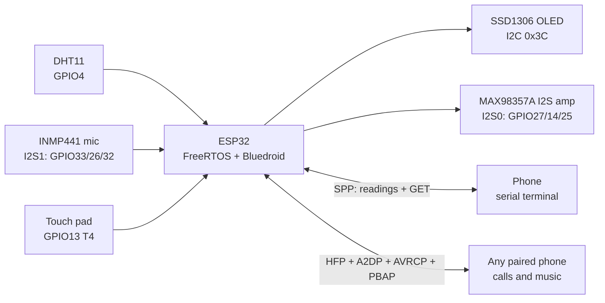
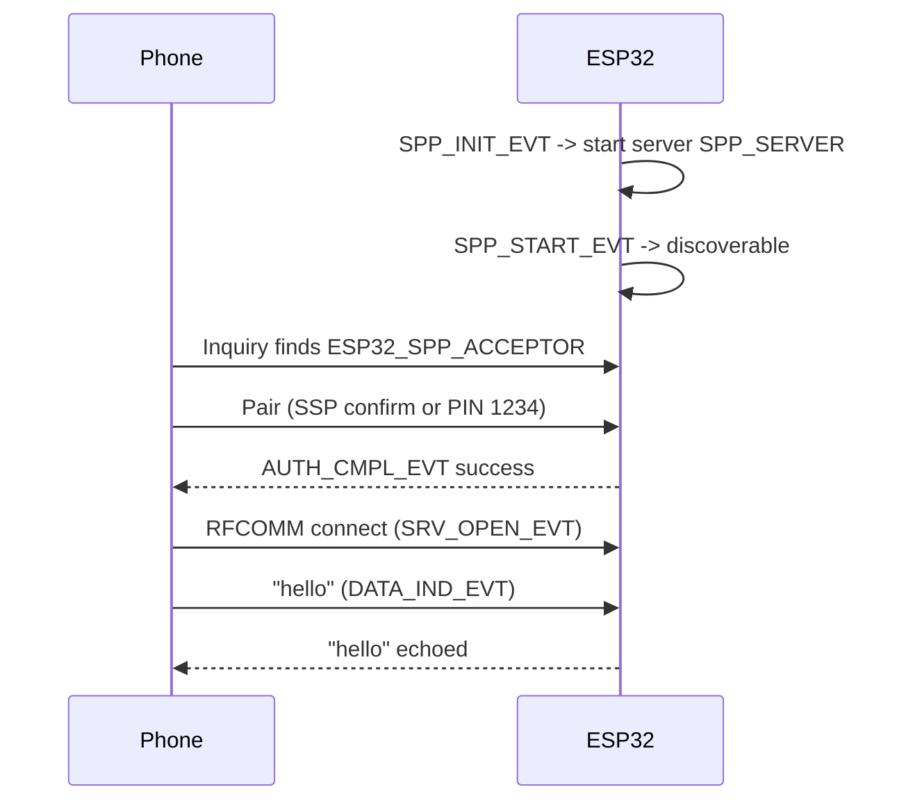
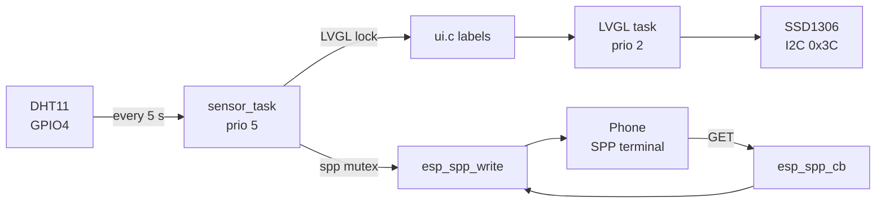
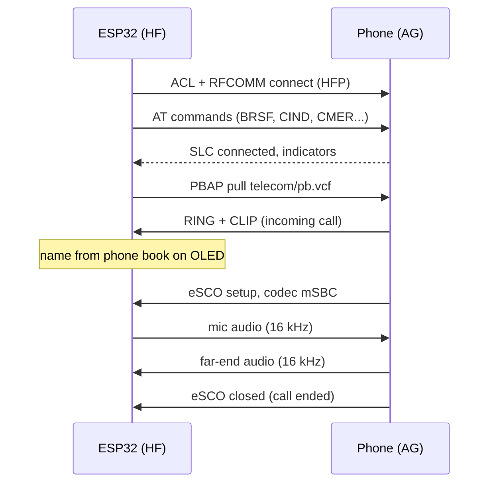
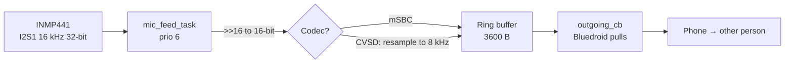
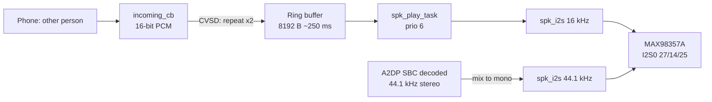
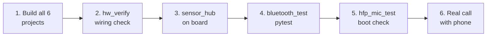

# ESP32 FreeRTOS Projects: Complete Build & Pipeline Guide

Last updated: 2026-09-24

## 1. Overview

This repo holds six ESP-IDF firmware projects for one ESP32 on a breadboard. Together they build up to two working pipelines: a sensor hub (DHT11 to OLED to Bluetooth) and a Bluetooth hands-free unit that sends an I2S mic into phone calls.

- **Repository:** github.com/arjunevaibhavpatil1434-alt/esp32-freertos, branch `master`
- **SDK:** ESP-IDF v6.1-dev (FreeRTOS kernel, Bluedroid Bluetooth stack), target `esp32`
- **Board:** ESP32 dev board on `/dev/ttyUSB0`, chip revision v3.1, 4 MB flash (image header says 2 MB)

| Project | Role | Status (2026-09-24) |
| --- | --- | --- |
| `freertos_test` | Minimal FreeRTOS hello-world | Builds |
| `dht11_temperature` | Read DHT11 temperature/humidity | Builds |
| `hw_verify` | Breadboard wiring self-test: DHT11, OLED, mic | Passed on hardware |
| `bluetooth_test` | Classic BT SPP echo server | pytest passed on hardware |
| `sensor_hub` | DHT11 → OLED → Bluetooth SPP pipeline | Passed on hardware (after DHT11 fix) |
| `hfp_mic_test` | Bluetooth headset product: calls, music, caller/track display, touch control | Calls, music, display verified on hardware (2026-09-25); touch gestures not yet confirmed |
| `pipeline_check` | Whole-board hardware check: DHT11, OLED, mic, MAX98357A speaker, pin readback, speaker→mic loopback | Passed on hardware except the loopback (mic too far from speaker) |



Sensors, the mic and the touch pad feed into the ESP32. Readings go to the OLED (and over SPP in `sensor_hub`); call audio goes both ways over HFP, and music comes in over A2DP to the amp.

## 2. Hardware and wiring

Every part shares the ESP32's GND. Everything runs from 3.3 V except the MAX98357A amp, which takes 5 V from the ESP32's VIN pin. The pin map below is the one currently wired and used by the firmware.

### Bill of materials

| Part | Used by | Notes |
| --- | --- | --- |
| ESP32 dev board (ESP32-D0WD, rev v3.1) | All | USB-serial on `/dev/ttyUSB0` |
| DHT11 temperature/humidity sensor | dht11\_temperature, hw\_verify, sensor\_hub | Single-wire, internal pull-up |
| SSD1306/SH1106 128×64 OLED, I2C | hw\_verify, sensor\_hub | Address `0x3C` |
| INMP441 I2S MEMS mic | hw\_verify, hfp\_mic\_test | 24-bit, left channel |
| MAX98357A I2S class-D amp + 4–8 Ω speaker | hfp\_mic\_test, pipeline\_check | Digital I2S input; 3 W; gain pin left open = 9 dB |
| Touch pad: wire end, foil or copper tape (\~2×2 cm) | hfp\_mic\_test | Uses the ESP32's built-in capacitive touch; no extra part |
| Android phone (any; tested with POCO F4 and others) | bluetooth\_test, sensor\_hub, hfp\_mic\_test | Host PC has no Bluetooth adapter |

### Pin map

| Component | Signal | ESP32 GPIO | Notes |
| --- | --- | --- | --- |
| DHT11 | DATA | GPIO4 | Bit-banged, timing-critical |
| OLED | SDA | GPIO21 | I2C port 0, 400 kHz |
| OLED | SCL | GPIO22 |  |
| INMP441 | WS (word select) | GPIO33 | Was GPIO25 until 2026-09-24 |
| INMP441 | SCK (bit clock) | GPIO26 |  |
| INMP441 | SD (data) | GPIO32 |  |
| INMP441 | L/R | GND | Selects left slot |
| MAX98357A | BCLK | GPIO27 | I2S0 bit clock |
| MAX98357A | LRC | GPIO14 | I2S0 word select |
| MAX98357A | DIN | GPIO25 | I2S0 data out |
| MAX98357A | SD | 3V3 | Must be high or the amp stays off; selects the left channel |
| MAX98357A | GAIN | not connected | 9 dB |
| MAX98357A | VIN / GND | VIN (5 V) / GND | |
| Touch pad | T4 | GPIO13 | Built-in capacitive touch; keep the wire short and away from GPIO27/14 |

GPIO5, 18 and 19 are avoided for the mic: those breadboard rows gave garbage readings in the past. GPIO0 and GPIO12 are avoided for touch: they are boot-strap pins.

### Speaker wiring (MAX98357A)

The MAX98357A is a digital amplifier: it takes I2S (bit clock, word clock, data), not an analog signal, so it needs all three signal wires. An analog signal on DIN alone gives silence.

```text
ESP32 GPIO27 ──── BCLK
ESP32 GPIO14 ──── LRC        MAX98357A ──(+ / −)── speaker
ESP32 GPIO25 ──── DIN
ESP32 3V3    ──── SD         (amp on, left channel)
ESP32 VIN    ──── VIN        (5 V)
ESP32 GND    ──── GND
```

The firmware sends the same mono audio on both I2S slots, so any SD channel setting plays it. Music is mixed down from stereo to mono for the same reason.

## 3. Setting up from scratch

A fresh Ubuntu machine needs system packages, the ESP-IDF checkout inside the repo, and serial-port access. The versions below are the ones this repo was last built with.

| Tool | Version in use |
| --- | --- |
| Host OS | Ubuntu 22.04.5 LTS |
| ESP-IDF | v6.1-dev-7947-g8438b4b0ca0 (commit 8438b4b0ca0, 2026-09-16) |
| Compiler | xtensa-esp-elf-gcc 16.1.0 (esp-16.1.0\_20260609) |
| CMake / Ninja | 3.22.1 / 1.10.1 |
| Python | 3.10.12, venv `~/.espressif/python_env/idf6.2_py3.10_env` |
| esptool | 5.4.0 |
| pytest / pytest-embedded | 9.1.1 / 2.9.3 |

### Steps

1. Install system packages:

```bash
sudo apt-get update
sudo apt-get install -y git wget flex bison gperf python3 python3-pip python3-venv \
  cmake ninja-build ccache libffi-dev libssl-dev dfu-util libusb-1.0-0
```

2. Clone the project, then ESP-IDF inside it. `esp-idf/` is in `.gitignore`, so it never gets committed:

```bash
git clone https://github.com/arjunevaibhavpatil1434-alt/esp32-freertos.git
cd esp32-freertos
git clone --recursive https://github.com/espressif/esp-idf.git
./esp-idf/install.sh esp32
```

3. Let your user open the serial port, then log out and back in:

```bash
sudo usermod -aG dialout $USER
ls -l /dev/ttyUSB0      # crw-rw---- root dialout
```

4. Load the environment in every new shell:

```bash
source esp-idf/export.sh
idf.py --version
```

5. Optional, for automated hardware tests (section 10):

```bash
pip install pytest-embedded pytest-embedded-idf pytest-embedded-serial-esp
```

6. Build and flash a first project to prove the chain works:

```bash
cd freertos_test
idf.py set-target esp32
idf.py -p /dev/ttyUSB0 flash monitor   # Ctrl+] exits the monitor
```

## 4. Repository layout

Git tracks 62 files across six projects; about 3,550 lines of C live in the `main/` folders. Each project is a standalone ESP-IDF app with the same shape: a top-level `CMakeLists.txt`, a `main/` component, and a committed `sdkconfig`.

### Tree

```text
esp32-freertos/
├── .gitignore                     # ignores esp-idf/, build/, managed_components/, dependencies.lock, sdkconfig.old
├── README.md                      # project index + setup
├── esp-idf/                       # ESP-IDF SDK checkout (NOT tracked)
│
├── freertos_test/                 # 1. FreeRTOS hello-world
│   ├── CMakeLists.txt
│   ├── README.md
│   ├── pytest_hello_world.py
│   ├── sdkconfig  ·  sdkconfig.ci
│   └── main/
│       ├── CMakeLists.txt
│       └── hello_world_main.c
│
├── dht11_temperature/             # 2. DHT11 reader
│   ├── CMakeLists.txt  ·  README.md  ·  pytest_hello_world.py
│   ├── sdkconfig  ·  sdkconfig.ci
│   └── main/
│       ├── CMakeLists.txt
│       ├── main.c                 # 2 s read loop
│       └── dht11.c  ·  dht11.h     # bit-bang driver
│
├── hw_verify/                     # 3. wiring self-test
│   ├── CMakeLists.txt  ·  README.md (pin map)  ·  sdkconfig
│   └── main/
│       ├── CMakeLists.txt
│       ├── main.c                 # DHT11 x5, I2C scan, mic peak level
│       └── dht11.c  ·  dht11.h
│
├── bluetooth_test/                # 4. SPP echo server
│   ├── CMakeLists.txt             # project(bluetooth_test)
│   ├── README.md
│   ├── pytest_bt_spp_test.py      # hardware test
│   ├── sdkconfig  ·  sdkconfig.defaults  ·  sdkconfig.defaults.esp32s31
│   └── main/
│       ├── CMakeLists.txt
│       └── main.c                 # GAP + SPP callbacks
│
├── sensor_hub/                    # 5. DHT11 -> OLED -> SPP pipeline
│   ├── CMakeLists.txt  ·  sdkconfig  ·  sdkconfig.defaults
│   └── main/
│       ├── CMakeLists.txt
│       ├── idf_component.yml      # lvgl/lvgl 9.2.0
│       ├── main.c                 # OLED, BT, sensor task
│       ├── dht11.c  ·  dht11.h     # critical-section version
│       └── ui.c  ·  ui.h           # LVGL screen
│
├── hfp_mic_test/                  # 6. Bluetooth headset product
│   ├── CMakeLists.txt  ·  sdkconfig  ·  sdkconfig.defaults (complete build config)
│   └── main/
│       ├── CMakeLists.txt
│       ├── Kconfig.projbuild      # device name, optional pinned phone, SSP, console
│       ├── main.c                 # BT init, reconnect to last phone, DHT11 task
│       ├── bt_app_core.c/.h       # app task + message queue
│       ├── bt_app_hf.c/.h         # HFP client, mic uplink, call audio downlink
│       ├── bt_app_av.c/.h         # A2DP music to the amp, AVRCP titles + control
│       ├── bt_app_pbac.c/.h       # PBAP phonebook client
│       ├── contacts.c/.h          # number -> name table for the caller display
│       ├── spk_i2s.c/.h           # MAX98357A I2S driver, shared by calls and music
│       ├── oled_status.c/.h       # status screen
│       ├── touch_ctl.c/.h         # touch pad gestures
│       ├── dht11.c/.h             # critical-section DHT11 driver
│       ├── app_hf_msg_set.c/.h    # console commands for HFP
│       └── app_av_msg_set.c/.h    # console commands for A2DP/AVRCP
│
└── pipeline_check/                # 7. whole-board hardware check, no phone
    ├── CMakeLists.txt  ·  sdkconfig
    └── main/
        ├── CMakeLists.txt
        ├── main.c                 # DHT11, OLED, mic probe, amp pin readback, beep, loopback
        └── dht11.c/.h
```

### What each file type does

| File | Purpose | Tracked |
| --- | --- | --- |
| `CMakeLists.txt` (project root) | Includes `project.cmake`, names the app | Yes |
| `main/CMakeLists.txt` | `idf_component_register`: sources + `PRIV_REQUIRES` components | Yes |
| `sdkconfig` | Full generated config for the app | Yes |
| `sdkconfig.defaults` | Hand-written overrides applied when `sdkconfig` is created | Yes |
| `main/Kconfig.projbuild` | Adds project options to `menuconfig` | Yes |
| `main/idf_component.yml` | Component-manager dependencies | Yes |
| `pytest_*.py` | pytest-embedded hardware tests | Yes |
| `build/` | Compiler output, `.bin`/`.elf`, logs | No |
| `managed_components/`, `dependencies.lock` | Downloaded registry components | No |
| `sdkconfig.old` | Backup of the previous config | No |

## 5. Foundation projects: freertos\_test, dht11\_temperature, hw\_verify

These three are the building blocks. Run them in this order on a new board: toolchain first, then the sensor, then the full wiring check.

### 5.1 freertos\_test

Proves the toolchain, flashing and serial monitor work. `hello_world_main.c` prints "Hello world!", the chip model, core count, silicon revision, flash size and minimum free heap. It then counts down 10 s and calls `esp_restart()`.

```bash
cd freertos_test && idf.py -p /dev/ttyUSB0 flash monitor
```

Expected: `Hello world!`, then `This is esp32 chip with 2 CPU core(s)...` and a countdown to restart.

### 5.2 dht11\_temperature

Reads the DHT11 on GPIO4 every 2 s from a FreeRTOS task (`dht11_task`) and logs `Temperature: 26 C | Humidity: 55 %`.

**How the DHT11 driver works (`dht11.c`):**

1. Drive the line LOW for 20 ms (start signal), then HIGH for 30 µs.
2. Switch the pin to input. The sensor answers LOW \~80 µs, then HIGH \~80 µs.
3. Read 40 bits. Each bit starts with a \~50 µs LOW; the length of the HIGH that follows sets the bit (\~26 µs = 0, \~70 µs = 1). The driver samples the line 40 µs after the HIGH starts.
4. Bytes = humidity, humidity decimal, temperature, temperature decimal, checksum. The checksum must equal the sum of the first four bytes.

Each wait gives up after 1,000 µs and returns `ESP_FAIL` with the stage (e.g. `Bit 38 LOW timeout`).

### 5.3 hw\_verify

Flash this whenever wiring changes. It checks every sensor and prints a PASS/FAIL line per part over serial.

| Check | How | Pass condition |
| --- | --- | --- |
| DHT11 | 5 reads, 2.5 s apart | `[DHT11] RESULT: 5 ok / 0 failed` |
| OLED | Probe every I2C address 0x03–0x77 on SDA21/SCL22 | `[OLED] Found device at 0x3C` |
| Mic | I2S at 16 kHz on WS33/SCK26/SD32, peak level every 300 ms | Peak > 500 and varying: `[MIC] RESULT: signal detected` |

Last run (with WS still on GPIO25): DHT11 5/5 at 26 °C / 55 %, OLED found at 0x3C, mic peaks 185,000–2,600,000 (24-bit). The firmware now expects WS on GPIO33 and hasn't been re-run since the move.

## 6. bluetooth\_test: SPP echo server

This project proves the phone can find, pair with and exchange data with the ESP32 over Classic Bluetooth. It shows up as `ESP32_SPP_ACCEPTOR` and sends back every byte it receives. Its pytest passed on hardware on 2026-09-24.

### Config (`sdkconfig.defaults`)

```text
CONFIG_BT_ENABLED=y
CONFIG_BTDM_CTRL_MODE_BR_EDR_ONLY=y   # Classic only, no BLE
CONFIG_BT_CLASSIC_ENABLED=y
CONFIG_BT_BLE_ENABLED=n
CONFIG_BT_SPP_ENABLED=y
```

### Startup sequence (`app_main`)

1. `nvs_flash_init()`. Bluedroid stores pairing keys in NVS; the partition is erased and re-initialised if full or outdated.
2. `esp_bt_controller_mem_release(ESP_BT_MODE_BLE)` frees BLE memory.
3. Controller init + enable in `ESP_BT_MODE_CLASSIC_BT`.
4. `esp_bluedroid_init_with_cfg()` + `esp_bluedroid_enable()` start the host stack.
5. Register the GAP callback (pairing) and SPP callback (data).
6. `esp_spp_enhanced_init()` in callback mode with L2CAP ERTM.
7. Security: SSP IO capability `ESP_BT_IO_CAP_IO` (display yes/no); legacy PIN set to variable.



Only when the SPP server has started does the ESP32 name itself and turn on discoverable mode, so the phone never sees a half-ready device.

### Pairing

| Method | When | ESP32 behaviour |
| --- | --- | --- |
| Secure Simple Pairing, numeric comparison | Modern phones | `CFM_REQ_EVT`, auto-confirms; accept on phone |
| Legacy PIN | Old devices, SSP unsupported | Replies PIN `1234` (16 zeros if 16 digits required) |

### Test from a phone

1. Flash, wait for `Discoverable as 'ESP32_SPP_ACCEPTOR'`.
2. Pair from the phone's Bluetooth settings.
3. Open a serial Bluetooth terminal app, connect, send text; the same text comes back.

### Automated test

`pytest_bt_spp_test.py` flashes the board and waits for two lines logged in a fixed order: `SPP server started`, then `Discoverable as 'ESP32_SPP_ACCEPTOR'`.

```bash
cd bluetooth_test
pytest pytest_bt_spp_test.py --embedded-services esp,idf --target esp32 --port /dev/ttyUSB0
```

## 7. sensor\_hub: DHT11 → OLED → Bluetooth pipeline

Every 5 s the sensor hub reads the DHT11, shows the reading on the OLED, and pushes it to a connected phone as `T:26C H:57%`. A phone can also send `GET` for an immediate reading. With the DHT11 fix in place, 12 of 13 reads succeeded over 65 s on hardware (before the fix: 0 of 8).



The sensor task drives both outputs; the SPP callback answers `GET` on its own by doing a fresh read.

### Config and dependencies

- `sdkconfig.defaults`: Classic BT + SPP, no BLE; `CONFIG_LV_CONF_SKIP=y` (LVGL configured from Kconfig), `LV_USE_OBSERVER`, `LV_USE_SYSMON`.
- `main/idf_component.yml`: `lvgl/lvgl: "9.2.0"`, downloaded into `managed_components/` on first build.
- `PRIV_REQUIRES`: `bt nvs_flash esp_driver_gpio esp_driver_i2c esp_lcd esp_timer`.

### Startup (`app_main`)

1. Create `spp_state_mutex`.
2. `dht11_init(GPIO4)`: input/output pin with pull-up.
3. `oled_init()`: I2C master bus (port 0, 400 kHz, internal pull-ups) → `esp_lcd` SSD1306 panel (128×64, 1 bpp) → LVGL display in I1 (monochrome) format, full-frame render → 5 ms `esp_timer` tick → LVGL task → `sensor_ui_init()`.
4. `bt_init()`: NVS, controller (Classic), Bluedroid, GAP + SPP callbacks, SPP server `SPP_SERVER`, discoverable as `ESP32_SENSOR_HUB`.
5. Start `sensor_task` (4 KB stack, priority 5).

### Tasks and shared state

| Task / context | Does | Protects shared state with |
| --- | --- | --- |
| `sensor_task` | Read DHT11, update UI, send over SPP, sleep 5 s | LVGL lock, `spp_state_mutex` |
| LVGL task (`lvgl_port_task`) | `lv_timer_handler()`, 5–500 ms sleep | `lvgl_api_lock` |
| `esp_timer` callback | `lv_tick_inc(5)` | none needed |
| Bluedroid callback task | GAP pairing, SPP connect/close/data, `GET` | `spp_state_mutex`, LVGL lock |

`spp_client_handle` (0 = no client) is the only BT state shared between tasks; every read or write goes through the mutex.

### OLED screen (`ui.c`)

Three LVGL labels: `ESP32 Sensor Hub` / `26C   57%RH` (or `sensor error`) / `BT: connected` or `BT: waiting`.

### Failure tolerance

A failed read keeps showing and sending the last good value. Only after 3 failures in a row (`SENSOR_MAX_CONSECUTIVE_FAILURES`) does the output switch to `sensor error` / `SENSOR_ERROR`.

### The DHT11 fix (commit f96266f)

With Bluetooth and LVGL running, interrupts arrived in the middle of the \~4 ms bit frame, and the driver missed the \~50 µs LOW pulses at the end. Every read failed with `Bit 38/39 LOW timeout`, while the same sensor passed 5/5 under `hw_verify`.

- **Fix:** the response + 40-bit read runs inside `portENTER_CRITICAL(&dht11_spinlock)`; errors are logged only after `portEXIT_CRITICAL`.
- **Cost:** interrupts on that core are masked for \~4 ms every 5 s; Bluetooth stayed stable in testing.
- **Better long-term option:** read the DHT11 with the RMT peripheral, which needs no interrupt masking.

### SPP protocol

| Direction | Message | Meaning |
| --- | --- | --- |
| ESP32 → phone | `T:26C H:57%\r\n` | Periodic reading (every 5 s) |
| ESP32 → phone | `SENSOR_ERROR\r\n` | 3+ consecutive failed reads |
| Phone → ESP32 | `GET` (any case, CR/LF trimmed) | Immediate reading |
| Phone → ESP32 | anything else | Echoed back as `echo: ...` |

Pairing is the same as `bluetooth_test`: SSP auto-confirm, legacy PIN `1234`.

## 8. hfp\_mic\_test: Bluetooth headset product

The ESP32 is a Bluetooth headset with a screen. Paired with a phone it carries calls (INMP441 mic up, MAX98357A speaker down), plays music, shows the caller or the song and the room temperature on the OLED, and takes a touch pad for answer / hang up / play / pause. Verified on hardware on 2026-09-25: calls both ways, music, caller number, track titles, temperature display, reconnect. Touch gestures are built but not yet confirmed on hardware.

### First use and every power-on

Flash once; nothing else to configure.

1. **First time:** on the phone, pair with `ESP_HFP_HF` (PIN `0000` if asked). Allow contact access when Android asks, for caller names.
2. **Every power-on:** the board reconnects by itself to the phone that connected last (saved in NVS). If none is saved, it tries each paired phone in turn. It tries every 15 s, 8 times, then waits for the phone to connect. Any phone can still pair or connect in at any time.
3. Pairings and the last-used phone survive reflashing; `idf.py erase-flash` clears them.

### Profiles running at once

| Profile | ESP32 role | Used for | Source file |
| --- | --- | --- | --- |
| HFP 1.x | Hands-Free (HF client) | Calls: ring, answer, audio both ways, caller number | `bt_app_hf.c` |
| A2DP | Sink | Music to the speaker | `bt_app_av.c` |
| AVRCP | Controller | Play/pause, track title and artist, track-change notifications | `bt_app_av.c` |
| PBAP | Client (PCE) | Phone book → number-to-name table for the caller display | `bt_app_pbac.c`, `contacts.c` |

### Source files

| File | Does |
| --- | --- |
| `main.c` | Start-up, reconnect-to-last-phone logic, DHT11 task |
| `bt_app_hf.c` | HFP events, mic uplink, call audio downlink |
| `bt_app_av.c` | A2DP music to the amp, AVRCP titles and control |
| `bt_app_pbac.c`, `contacts.c` | Phone book download and caller-name lookup (kept in RAM, never logged) |
| `spk_i2s.c` | The one MAX98357A driver, shared by calls (16 kHz) and music (44.1/48 kHz) |
| `oled_status.c` | Status screen: 5×7 ASCII font, scrolling text, retries until the panel answers |
| `touch_ctl.c` | Touch pad on GPIO13: self-calibrating, tap / long-press gestures |
| `dht11.c` | DHT11 driver (the critical-section version from `sensor_hub`) |

### Configuration (`sdkconfig.defaults`)

A fresh clone builds the same firmware from `sdkconfig.defaults` alone.

```text
CONFIG_ESPTOOLPY_FLASHSIZE_4MB=y             # the module has 4 MB
CONFIG_PARTITION_TABLE_SINGLE_APP_LARGE=y   # 1.5 MB app partition (app is ~1 MB)
CONFIG_BT_ENABLED=y  CONFIG_BT_BLE_ENABLED=n  CONFIG_BTDM_CTRL_MODE_BR_EDR_ONLY=y
CONFIG_BTDM_CTRL_BR_EDR_MAX_SYNC_CONN=1     # one SCO/eSCO voice link
CONFIG_BT_BLUEDROID_ENABLED=y  CONFIG_BT_CLASSIC_ENABLED=y
CONFIG_BT_HFP_ENABLE=y  CONFIG_BT_HFP_CLIENT_ENABLE=y
CONFIG_BT_HFP_AUDIO_DATA_PATH_HCI=y         # voice over HCI to the app, not PCM pins
CONFIG_BT_PBAC_ENABLED=y  CONFIG_BT_A2DP_ENABLE=y
CONFIG_EXAMPLE_LOCAL_DEVICE_NAME="ESP_HFP_HF"
CONFIG_EXAMPLE_PEER_DEVICE_ADDR=""          # no phone hard-coded
CONFIG_EXAMPLE_PEER_DEVICE_NAME=""
```

Wideband speech (mSBC, 16 kHz) is on by default in this ESP-IDF, so phones negotiate it. `CONFIG_BT_HFP_USE_EXTERNAL_CODEC` is off: Bluedroid encodes/decodes CVSD and mSBC itself.

### Kconfig options (`main/Kconfig.projbuild`, menu "HFP Example Configuration")

| Option | Default | Meaning |
| --- | --- | --- |
| `EXAMPLE_LOCAL_DEVICE_NAME` | `ESP_HFP_HF` | Name phones see when pairing |
| `EXAMPLE_PEER_DEVICE_ADDR` | empty | Pin one phone by address; empty = last-used phone, then any paired phone |
| `EXAMPLE_PEER_DEVICE_NAME` | empty | Only with no paired phone: discover a phone by this exact name |
| `EXAMPLE_SSP_ENABLED` | y | Secure Simple Pairing; off = legacy PIN only |
| `EXAMPLE_ENABLE_CONSOLE_REPL` | y | UART console with the commands below |

### Connection flow

1. `app_main`: NVS → controller (Classic) → Bluedroid → OLED task → DHT11 task (core 1) → touch task (core 1) → `bt_app_task_start_up()` → console REPL.
2. Stack-up event: GAP, HFP client, PBAP, A2DP sink + AVRCP; device name, PIN `0000`, connectable + discoverable.
3. Pick the reconnect target: configured address → last-used phone from NVS (if still paired) → each paired phone in turn. Page it every 15 s, 8 tries. The timer drives the retries, because a phone that is off doesn't always produce a disconnect event.
4. HFP goes `connected` → `slc_connected`. The phone is saved as last-used; PBAP pulls the phone book (VERSION, FN, N, TEL only).
5. The phone connects A2DP + AVRCP; AVRCP reads the notification capabilities, registers for track changes and fetches title and artist.
6. If a live link drops, a fresh round of 8 retries starts.



All signalling rides RFCOMM AT commands; the voice itself uses a separate synchronous (eSCO) link that exists only during the call.

### Uplink: mic → call



The mic task pushes PCM and calls `esp_hf_client_outgoing_data_ready()`; Bluedroid pulls fixed-size frames through `outgoing_cb` and encodes them.

### Downlink: call and music → speaker



Calls win: while call audio is up, music data is dropped, and the amp switches to 16 kHz; when the call ends, music switches it back. The call callback never blocks; the A2DP callback blocks at most 100 ms on the I2S write.

### Display (SSD1306, 8 text rows)

```text
BT CONNECTED           <- or BT WAITING
INCOMING CALL          <- or CALLING / IN CALL (HD) / MUSIC / NO CALL
Ravi Kumar             <- caller name, or song title (scrolls if long)
+919876543210          <- caller number, or artist
────────────────────
Temp      26 °C        <- DHT11 every 5 s; "--" until the first good read
Humidity  65 %
```

`MUSIC` shows while A2DP packets arrive (not from start/stop events, which can be missed). The last title stays up while paused. Non-ASCII characters show as `?`. Outgoing calls get their number from `AT+CLCC`, since there is no CLIP.

### Touch pad (GPIO13, T4)

| State | Tap (< 1 s) | Long press (1 s, fires while held) |
| --- | --- | --- |
| Ringing | Answer | Reject |
| Dialing / in call | Hang up | Hang up |
| Otherwise | Music play / pause | — |

The pad calibrates during the first \~2 s after power-on or reset: don't touch it then. Touched = the filtered reading below 85 % of the baseline for 2 polls (20 ms apart); released above 92 %. The baseline follows slow drift while untouched.

### Audio lifecycle

| Event | Action |
| --- | --- |
| Audio state `connected` (CVSD) or `connected_msbc` | Register data callbacks, lazy-init the I2S mic, set the amp to 16 kHz, set `s_audio_active` |
| During call | Mic task and speaker task run; buffers flow |
| Audio state `disconnected` | Clear `s_audio_active`, drain both ring buffers; hardware stays initialised |
| Audio state `connected_lc3` | Logged as an error: LC3 needs the external-codec path |

### Hardware constraints behind the design

- **Two I2S ports:** the mic has I2S1 and the amp I2S0, so each keeps its own clocks.
- **MAX98357A SD pin:** has an internal pull-down, so it must go to 3V3 or the amp stays in shutdown.
- **DHT11 timing:** a read masks interrupts for \~4 ms, so its task runs on core 1, away from the Bluetooth controller on core 0.
- **Touch pins:** most touch-capable pins are already used; GPIO13 is the free one that isn't a boot-strap pin.

### Console commands (UART, prompt `hfp_hf>`)

| Command | Action |
| --- | --- |
| `con` / `dis` | Connect / release the HFP link |
| `cona` / `disa` | Open / close the audio (voice) link |
| `ac` / `rc` | Answer / reject an incoming call |
| `d <num>` / `rd` / `dm` | Dial a number / redial / dial memory |
| `qop` / `qc` | Query operator / current calls |
| `vron` / `vroff` | Start / stop voice recognition |
| `vu` | Volume update |
| `rs` / `rv` / `rh` | Subscriber info / last voice tag / response-and-hold |
| `k <dtmf>` | Send a DTMF tone (0–9, \*, #, A–D) |
| `xp` / `bat` | Apple XAPL battery reporting / send battery level |
| `acon` / `adis` | Connect / disconnect A2DP |
| `play` / `pause` / `next` / `prev` | AVRCP transport control |
| `md` | AVRCP: request title/artist/album |

## 9. Bluetooth profiles and protocols reference

Every Bluetooth feature here is Classic Bluetooth (BR/EDR); BLE is disabled in all projects to save memory. The ESP32 runs Espressif's controller firmware plus the Bluedroid host stack, which talk over an internal HCI.

### Protocol stack

```text
+--------------------------------------------------------------+
| Your app: main.c, bt_app_hf.c, bt_app_av.c, bt_app_pbac.c   |
+----------------+-----------+------------+-------------+-----+
| SPP            | HFP (HF)  | A2DP sink  | AVRCP CT    | PBAP|  profiles
+----------------+-----------+------------+-------------+-----+
| RFCOMM (serial port emulation)  |  AVDTP     |  AVCTP  | OBEX |
+---------------------------------+------------+---------+------+
| L2CAP (channels, ERTM)     SDP (service discovery)           |
+--------------------------------------------------------------+
| GAP / security: inquiry, pairing (SSP / legacy PIN), bonding |
+--------------------------------------------------------------+
| HCI (host <-> controller; also carries SCO voice data here)  |
+--------------------------------------------------------------+
| Controller: baseband, link manager, radio (2.4 GHz)          |
+--------------------------------------------------------------+
```

### Terms

| Term | What it is | Where it matters here |
| --- | --- | --- |
| GAP | Discovery, connection and security rules | Device names, discoverable mode, inquiry for the phone |
| SSP | Secure Simple Pairing (BT 2.1+); numeric comparison or passkey | All projects auto-confirm numeric comparison |
| Legacy PIN | Pre-2.1 pairing with a shared PIN | `1234` (SPP projects), `0000`/`1234` (HFP) |
| Bonding | Pairing keys saved to NVS | Survives reflash; stale keys break pairing → forget + `erase-flash` |
| L2CAP | Multiplexed channels over one ACL link | ERTM enabled for SPP |
| SDP | Lists services a device offers | Phone finds SPP server / HFP service |
| RFCOMM | Serial-port emulation over L2CAP | SPP data; HFP AT commands |
| SPP | Serial Port Profile | `bluetooth_test`, `sensor_hub` |
| ACL link | Asynchronous data link | Everything except voice |
| SCO / eSCO | Synchronous voice links with reserved slots | Call audio; max 1 (`MAX_SYNC_CONN=1`) |
| HFP | Hands-Free Profile: AG = phone, HF = ESP32 | `hfp_mic_test` |
| SLC | Service Level Connection: HFP's AT-command session | Needed for the ESP32 to appear as a call audio route |
| CVSD | Narrowband voice codec, 8 kHz | Fallback; mic resampled 16 → 8 kHz |
| mSBC | Wideband voice codec, 16 kHz ("HD voice") | Negotiated by the POCO F4 |
| LC3-SWB | Super-wideband codec (HFP 1.9) | Not supported without external codec |
| A2DP / SBC | Stereo music streaming, SBC codec | Phone → ESP32 music (counted only) |
| AVDTP | Transport for A2DP | Stream setup |
| AVRCP / AVCTP | Remote control + metadata | play/pause, track title |
| PBAP / OBEX | Phone book access over object exchange | Pulls `telecom/pb.vcf` |
| HCI audio data path | SCO voice delivered to the app over HCI | `CONFIG_BT_HFP_AUDIO_DATA_PATH_HCI=y` |

### Key HFP AT commands (phone = AG, ESP32 = HF)

| AT command | Direction | Purpose |
| --- | --- | --- |
| `AT+BRSF` | HF → AG | Exchange supported features |
| `AT+BAC` | HF → AG | Offer codecs (CVSD, mSBC) |
| `AT+CIND` / `AT+CMER` | HF → AG | Read and subscribe to indicators (call, signal, battery) |
| `RING` / `+CLIP` | AG → HF | Incoming call + caller number |
| `ATA` / `AT+CHUP` | HF → AG | Answer / hang up |
| `ATD<num>;` | HF → AG | Dial |
| `+BCS` / `AT+BCS` | both | Codec selection before audio opens |
| `AT+VGS` / `AT+VGM` | both | Speaker / mic gain |
| `AT+VTS` | HF → AG | DTMF tone |

### Codec parameters

| Codec | Sample rate | Frame | Where encoded |
| --- | --- | --- | --- |
| CVSD | 8 kHz, 16-bit mono PCM in | 60/120 bytes per packet | Bluedroid (internal) |
| mSBC | 16 kHz, 16-bit mono PCM in | 120 samples (240 bytes) per 7.5 ms | Bluedroid (internal) |

## 10. Command reference

Run every command from inside a project folder after `source esp-idf/export.sh` (use the correct relative path). The port is `/dev/ttyUSB0`.

### Build, flash, monitor

| Command | What it does |
| --- | --- |
| `idf.py set-target esp32` | Pick the chip (once per project; wipes `build/`) |
| `idf.py build` | Compile; output in `build/<project>.bin` |
| `idf.py -p /dev/ttyUSB0 flash` | Write bootloader, partition table, app |
| `idf.py -p /dev/ttyUSB0 -b 115200 flash` | Slower, more reliable flash (use if the serial link drops) |
| `idf.py -p /dev/ttyUSB0 monitor` | Serial console; `Ctrl+]` exits |
| `idf.py -p /dev/ttyUSB0 flash monitor` | Both in one step |
| `idf.py menuconfig` | Edit config (e.g. HFP Example Configuration) |
| `idf.py size` | Show app and memory size |
| `idf.py fullclean` | Delete all build output |
| `idf.py -p /dev/ttyUSB0 erase-flash` | Wipe the whole chip, including NVS pairing keys |

### Build everything at once

```bash
source esp-idf/export.sh
for p in freertos_test dht11_temperature hw_verify bluetooth_test sensor_hub hfp_mic_test; do
  (cd $p && idf.py build > /tmp/build_$p.log 2>&1; echo "$p: exit $?")
done
```

### Capture serial output to a file (no interactive monitor)

Used for all hardware test runs; it resets the board, then records for N seconds.

```python
# cap.py  usage: python3 cap.py /dev/ttyUSB0 <seconds> <outfile>
import serial, sys, time
port, secs, out = sys.argv[1], float(sys.argv[2]), sys.argv[3]
s = serial.Serial(port, 115200, timeout=0.2)
s.dtr = False; s.rts = True; time.sleep(0.1); s.rts = False   # hard reset
end = time.time() + secs
with open(out, "wb") as f:
    while time.time() < end:
        f.write(s.read(4096)); f.flush()
```

```bash
python3 cap.py /dev/ttyUSB0 60 run.log
sed 's/\x1b\[[0-9;]*m//g' run.log | grep -a SENSOR_HUB   # strip colours, filter
```

### Automated tests

```bash
pip install pytest-embedded pytest-embedded-idf pytest-embedded-serial-esp
cd bluetooth_test
pytest pytest_bt_spp_test.py --embedded-services esp,idf --target esp32 --port /dev/ttyUSB0
```

Logs land in `/tmp/pytest-embedded/<timestamp>/.../dut.log`.

### Git

| Command | Use |
| --- | --- |
| `git switch -c <branch>` | Start work off `master` |
| `git switch master && git merge --ff-only <branch>` | Bring work in without a merge commit |
| `git push origin master` | Publish |
| `git branch -d <branch>` | Remove a merged branch |

## 11. Testing and verification process

Testing goes from cheapest to most real: compile everything, check the wiring, run each pipeline on the board, then finish with a real phone call. Each stage must pass before the next is worth running.



### Procedure

1. **Build:** all six projects must build with 0 errors and 0 warnings.
2. **Wiring:** flash `hw_verify`; all three RESULT lines must pass.
3. **Sensor pipeline:** flash `sensor_hub`, capture 60 s; expect SPP server up, discoverable, and most reads OK (the first read during BT startup may fail).
4. **SPP:** run the `bluetooth_test` pytest.
5. **Whole board, no phone:** flash `pipeline_check`; expect DHT11 OK, OLED OK, `MIC SIGNAL`, all three `[SPK pin]` lines `toggling OK`, and an audible 1 kHz beep (1 s on, 1 s off).
6. **HFP boot:** flash `hfp_mic_test`; expect a single boot, all profiles `Init Complete`, `status display on at 0x3C`, `TOUCH: pad on GPIO13 ready`, and `Reconnect target: ...` if a phone is paired.
7. **Real call:** keep a serial capture running, pair the phone, place or answer a call. Check for `audio state connected_msbc`, `mic: streaming to call at 16kHz (mSBC)`, no `rb send fail`, no panic. Ask the other person how it sounds.

### Results on record

| Stage | Result | Evidence |
| --- | --- | --- |
| Reconnect at power-on (2026-09-25) | Pass | No phone hard-coded; rotated through 3 paired phones every 15 s |
| Touch pad (2026-09-25) | Built, not confirmed | Calibrates (baseline \~1810); no gesture captured yet |
| Temperature on OLED (2026-09-25) | Pass | 26 °C / 65 %; first 1–2 reads during BT start-up fail the checksum and are skipped |
| Caller number / name (2026-09-25) | Number pass; name needs contact access | One phone sent a 620-contact phone book (500 loaded under the old table limit, now up to 1500); POCO F4 refused PBAP until contact sharing is allowed |
| Music titles (2026-09-25) | Pass | Title and artist on every track change; calls interrupt and music resumes |
| Music on speaker (2026-09-25) | Pass | A2DP 44.1 kHz stereo → mono → MAX98357A, heard clearly |
| Real call, both ways (2026-09-25) | Pass | Caller heard on the MAX98357A; mic heard by the caller |
| pipeline\_check (2026-09-25) | Pass except loopback | Beep heard; all 3 amp pins toggling; mic signal; loopback fails (mic far from speaker) |
| Real call, mic uplink | Pass: other person heard clearly | POCO F4 incoming call, mSBC, \~56 s, 0 overruns, 0 crashes |
| hfp\_mic\_test boot | Pass | 1 boot, HFP/A2DP/AVRCP init complete |
| bluetooth\_test pytest | Pass | 1 passed in 12.17 s |
| sensor\_hub, after DHT11 fix | Pass | 12/13 reads over 65 s; later runs 5/6 and 4/5 |
| sensor\_hub, before fix | Fail | 0/8 reads, `Bit 38/39 LOW timeout` |
| hw\_verify | Pass | DHT11 5/5, OLED at 0x3C, mic signal detected |
| Build all 6 (2026-09-24) | Pass | 0 errors, 0 warnings |

### Not yet tested

- [ ] Touch gestures on hardware: tap to answer / hang up / play / pause, long press to reject
- [ ] Caller name on a phone that allows contact sharing (lookup tested on the PC with sample vCards)
- [ ] `sensor_hub` with a phone: pairing, 5 s pushes, `GET`

## 12. Git workflow and history

Work happens on a short-lived branch, gets fast-forwarded into `master`, is pushed to GitHub, and then the branch is deleted. Commit messages record what was tested on hardware and what wasn't.


Fast-forward merges keep history linear with no merge commits.

### Commit history (newest first)

| Date | Commit | Change |
| --- | --- | --- |
| 2026-09-25 | `5bb804b` | Add pipeline\_check: whole-board hardware check without a phone |
| 2026-09-25 | `8019082` | hfp\_mic\_test: standalone headset product (I2S amp, music, display, touch, reconnect) |
| 2026-09-24 | `25f247e` | Add complete project guide |
| 2026-09-24 | `419c564` | hw\_verify: mic WS on GPIO33, document speaker wiring |
| 2026-09-24 | `9c87da4` | hfp\_mic\_test: play far-end call audio on the GPIO25 DAC (untested) |
| 2026-09-24 | `60f9a99` | hfp\_mic\_test: target the POCO F4 instead of the Narzo 50A |
| 2026-09-24 | `9d5f0ca` | hfp\_mic\_test: feed mic at 16 kHz for mSBC calls, fix hang-up race (verified on a call) |
| 2026-09-24 | `092af97` | hfp\_mic\_test: move peer phone address into Kconfig |
| 2026-09-24 | `3b9d4a4` | bluetooth\_test: rename CMake project from bt\_discovery |
| 2026-09-24 | `d9a3753` | bluetooth\_test: update pytest for the SPP acceptor |
| 2026-09-24 | `1588817` | bluetooth\_test: rewrite README for the SPP echo server |
| 2026-09-24 | `2208c63` | README: list sensor\_hub and hfp\_mic\_test |
| 2026-09-24 | `91af402` | Add hfp\_mic\_test |
| 2026-09-24 | `56a721f` | bluetooth\_test: discovery demo → SPP acceptor with pairing |
| 2026-09-24 | `f96266f` | sensor\_hub: read DHT11 frame inside a critical section |
| 2026-09-24 | `0a9e79b` | Add sensor\_hub pipeline |
| 2026-09-23 | `109ca3d` | Add root README |
| 2026-09-23 | `ba8ae1a` | Initial commit of ESP32 FreeRTOS test projects |

## 13. Known issues, troubleshooting, next steps

`hfp_mic_test` is feature-complete for calls, music and display. The open items are confirming the touch gestures and the DHT11 reads that fail while the radio is busy.

### Known issues

| Issue | Impact | Mitigation |
| --- | --- | --- |
| DHT11 reads can fail while Bluetooth is paging (start-up, reconnect tries) | Reading skipped; display keeps the last good value | Checksum rejects bad frames; an RMT-based driver would remove the cause |
| DHT11 read masks interrupts \~4 ms every 5 s | Runs on core 1, away from the BT controller | Move to the RMT peripheral |
| OLED sometimes misses the first probe after power-on | Display appears \~1–2 s late | Display task retries every second |
| Font is ASCII only | Names in other scripts show as `?` | Needs a Unicode font |
| Phone book limited by free RAM (up to 1500 numbers, names cut to 23 chars) | Very large phone books are partly loaded | Logged as "out of memory, rest skipped" |
| Some phones refuse PBAP until contact sharing is allowed | Number only, no name | Allow contacts in the phone's Bluetooth device settings |
| `speaker_test` still drives the GPIO25 DAC | Silent on the MAX98357A | Use `pipeline_check` for speaker tests |
| Old commits contain a phone Bluetooth address | Minor privacy | Removed from current config; history keeps it |
| Some serial log lines garbled | Cosmetic | None yet |

### Troubleshooting

| Symptom | Likely cause | Fix |
| --- | --- | --- |
| Flash fails: "No more data to read from the serial port" | USB link dropped mid-write | Retry with `-b 115200`; shorter/better cable |
| Permission denied on `/dev/ttyUSB0` | User not in `dialout` | `sudo usermod -aG dialout $USER`, log in again |
| Pairing failed, status N (`Authentication fail reason 5`) | Stale bonding keys | Forget device on phone and pair again; or `idf.py erase-flash` |
| ESP32 connects to the wrong phone | Another paired phone answered first | Connect the wanted phone once (it becomes last-used), or pin it with `EXAMPLE_PEER_DEVICE_ADDR` |
| Phone can't find `ESP_HFP_HF` | A test firmware (`pipeline_check`) is flashed | Flash `hfp_mic_test` |
| Silent speaker, SPK activity in the log | MAX98357A SD low, or BCLK/LRC not wired | SD to 3V3; wire BCLK→27, LRC→14; run `pipeline_check` |
| Touch never triggers | Pad touched during calibration, or wire too long | Reset with the hand away; shorter wire, bigger pad |
| Touch triggers by itself | Pad wire near the amp's clock wires | Route the GPIO13 wire away from GPIO27/14 |
| DHT11 `Bit 38/39 LOW timeout` | Interrupts during bit frame | Use the critical-section driver from `sensor_hub` |
| Other person hears choppy, fast voice | Mic fed at 8 kHz on an mSBC call | Fixed in `9d5f0ca` |
| No mic audio after rewiring | WS not on GPIO33 | Move WS jumper; run `hw_verify` |
| Hum from speaker | Ground loop | Power speaker/amp from the ESP32's USB source |
| Bluetooth not selectable during a call | Only paired, no SLC | Wait for `slc_connected` in the log; check peer config |

### Next steps

- [ ] Confirm touch gestures on hardware; tune `PRESS_RATIO` in `touch_ctl.c` if needed
- [ ] Optional: RMT-based DHT11 driver shared across projects
- [ ] Optional: volume up/down on a second touch pad (GPIO15, T3)
- [ ] Optional: recording to the PC over Wi-Fi, or to an SD card
